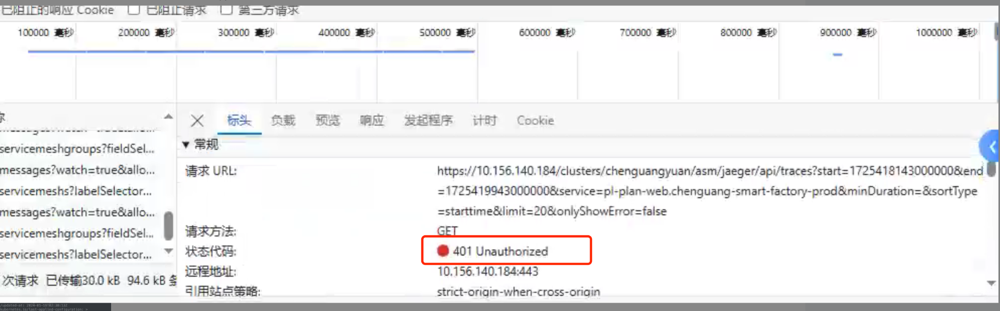
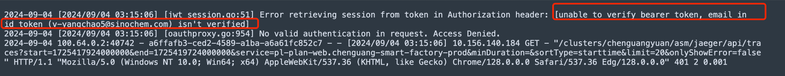
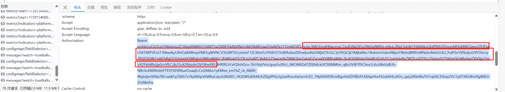
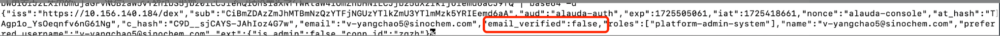
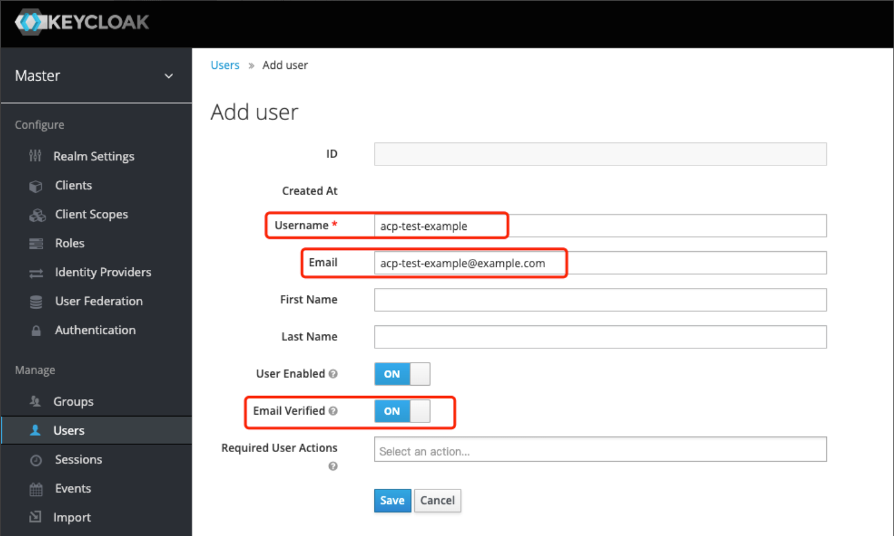
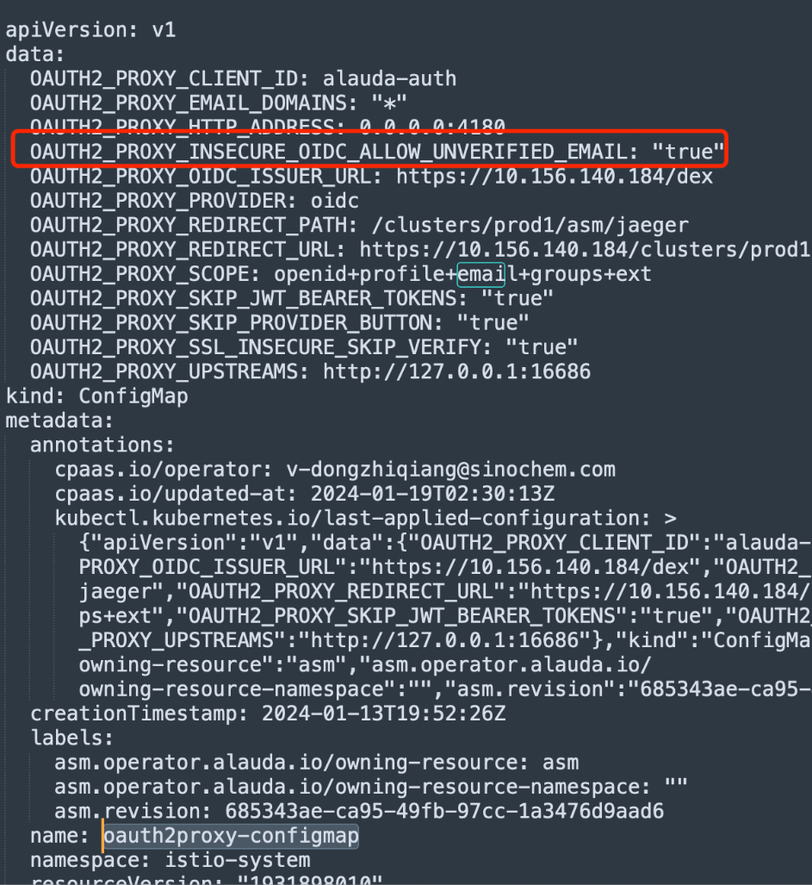

---
kind:
  - Troubleshooting
products:
  - Alauda Container Platform
  - Alauda DevOps
  - Alauda AI
  - Alauda Application Services
  - Alauda Service Mesh
  - Alauda Developer Portal
ProductsVersion:
  - 4.1.0,4.2.x
---
<!-- A type of document that involves encountering a fault, diagnosing it, performing root cause analysis, and providing solutions. -->

# 通过sso同步过来的用户没有查询asm调用链的权限401

用户查看asm调用链不显示，前端报错401 jaeger-prod-query的oauth2容器日志显示参数缺失 token中email_verfied字段为false

## Cause
- sso server端未开启email_verified参数导致token携带email_verfied=false

## Resolution
- 修改istio-system命名空间下oauth2proxy-configmap，增加email_verified参数配置
- 重启jaeger-prod-controller和jaeger-prod-query的pod

## [workaround]

## [Related Information]
**Screenshots**

- Environment: 通用版本
- jaeger-prod-query
- oauth2容器
- oauth2proxy-configmap
- istio-system
- jaeger-prod-controller
- Component: 用户
- Page ID: 238523866
- Original Title: 通过sso同步过来的用户没有查询asm调用链的权限401
