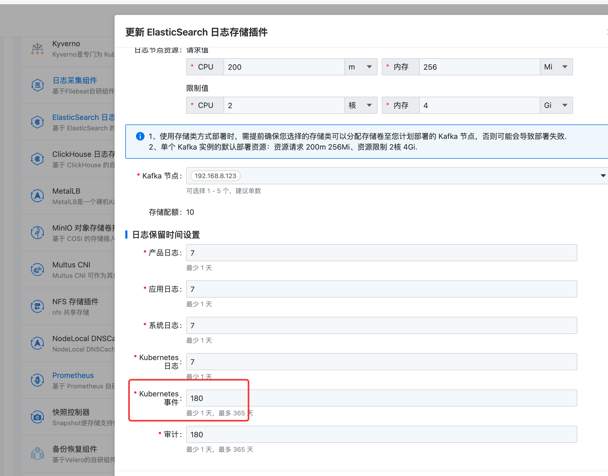

---
kind:
  - Troubleshooting
products:
  - Alauda Container Platform
  - Alauda DevOps
  - Alauda AI
  - Alauda Application Services
  - Alauda Service Mesh
  - Alauda Developer Portal
ProductsVersion:
  - 4.1.0,4.2.x
---
<!-- A type of document that involves encountering a fault, diagnosing it, performing root cause analysis, and providing solutions. -->

# 平台历史告警保存多久，存储位置在哪里

JIRA Jira：

## Cause

## Resolution
- 平台历史告警默认保存30天，超过30天的告警数据会被自动清理
- 告警数据存储在平台的持久化存储中，具体位置可通过告警系统的配置查看
- 通过配置告警系统的存储策略可延长保存时间

## [workaround]

## [Related Information]
**Screenshots**

- Environment: v3.16.2
- 告警系统配置
- 存储策略
- Component: 用户
- Page ID: 292945932
- Original Title: 基础架构-平台历史告警保存多久，存储位置在哪里-108751-zh
