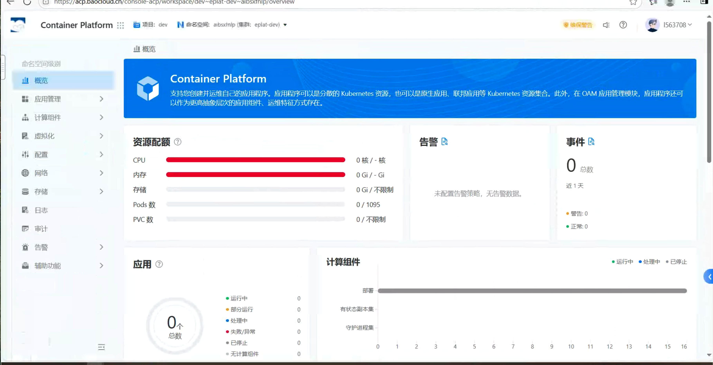
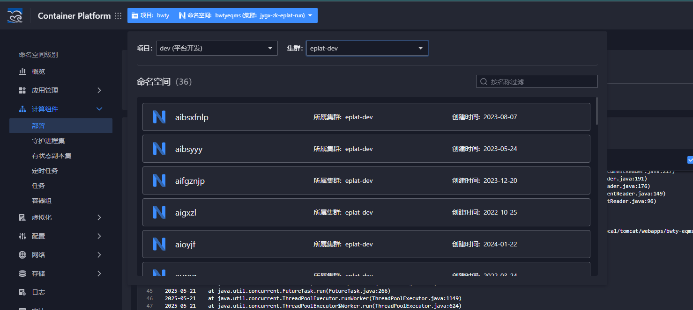
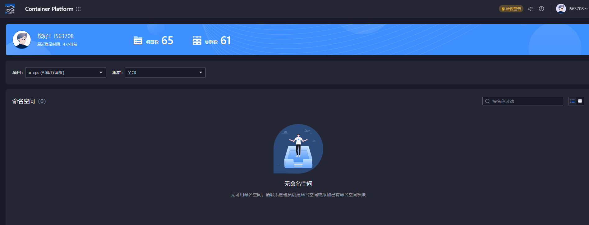

---
kind:
  - Troubleshooting
products:
  - Alauda Container Platform
  - Alauda DevOps
  - Alauda AI
  - Alauda Application Services
  - Alauda Service Mesh
  - Alauda Developer Portal
ProductsVersion:
  - 4.1.0,4.2.x
---
<!-- A type of document that involves encountering a fault, diagnosing it, performing root cause analysis, and providing solutions. -->

# 用户角色权限问题

管理员权限和对应命名空间权限无法查看eplat-dev命名空间的内容

## Cause
- 用户没有被正确绑定到eplat-dev命名空间的访问角色

## Resolution
- 创建或更新RoleBinding，将用户账户绑定到具有eplat-dev命名空间访问权限的角色
- 应用新的RBAC配置后验证访问
- 使用kubectl auth can-i命令验证权限
- 参考Kubernetes RBAC授权指南

## [workaround]

## [Related Information]
**Screenshots**

- Environment: v3.12.2
- RoleBinding
- ClusterRole
- kubeconfig
- kubectl auth can-i
- RBAC授权指南
- Component: 用户
- Page ID: 299139835
- Original Title: 基础架构-用户角色权限问题-108829-zh
