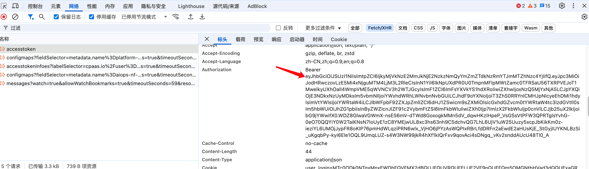

---
kind:
  - Troubleshooting
products:
  - Alauda Container Platform
  - Alauda DevOps
  - Alauda AI
  - Alauda Application Services
  - Alauda Service Mesh
  - Alauda Developer Portal
ProductsVersion:
  - 4.1.0,4.2.x
---
<!-- A type of document that involves encountering a fault, diagnosing it, performing root cause analysis, and providing solutions. -->

# 产品是否有创建用户API令牌的接口

JIRA Jira：

## Cause

## Resolution
- 发送POST请求到`/api/v1/users/{userId}/tokens`端点创建API令牌，需包含认证信息和请求体参数（如令牌名称、过期时间）。创建成功后保存返回的令牌字符串

## [workaround]

## [Related Information]
**Screenshots**

- Environment: v4.0.1
- /api/v1/users/{userId}/tokens
- Component: 用户
- Page ID: 299600057
- Original Title: 基础架构-产品是否有创建用户API令牌的接口-110086-zh
