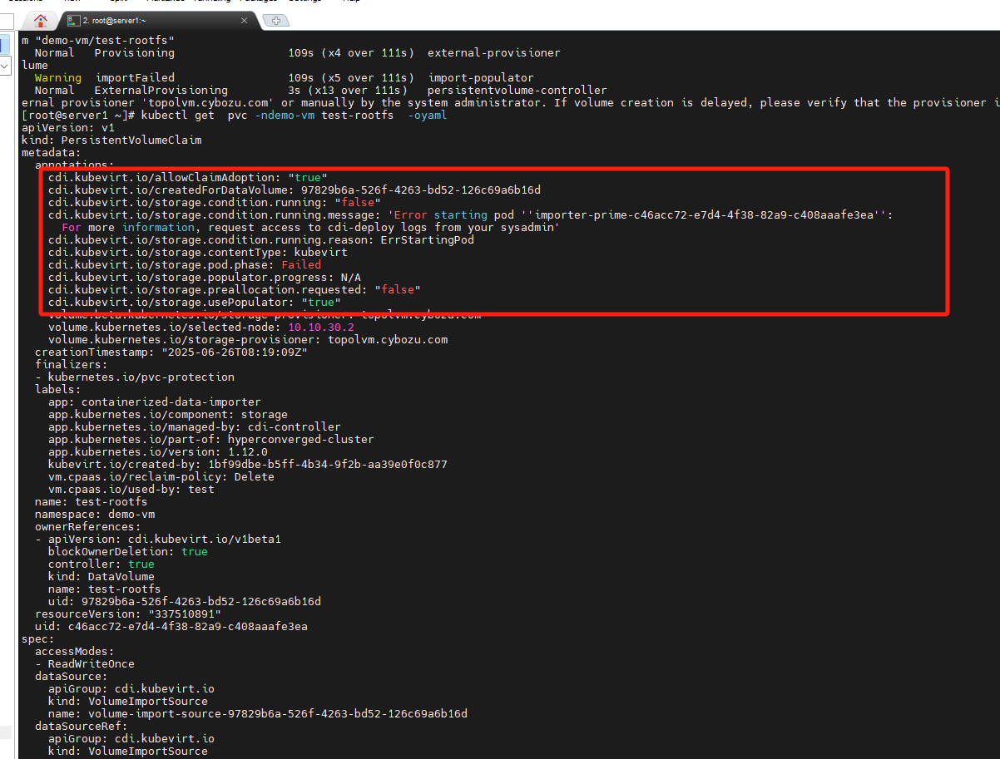
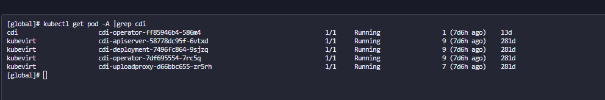
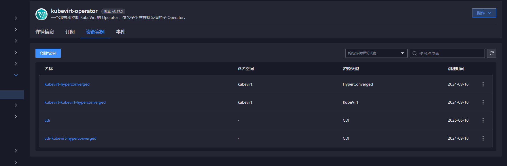

---
kind:
  - Troubleshooting
products:
  - Alauda Container Platform
  - Alauda DevOps
  - Alauda AI
  - Alauda Application Services
  - Alauda Service Mesh
  - Alauda Developer Portal
ProductsVersion:
  - 4.1.0,4.2.x
---
<!-- A type of document that involves encountering a fault, diagnosing it, performing root cause analysis, and providing solutions. -->

# kubevirt创建VM失败

创建KubeVirt虚拟机失败 VolumeBinding失败 自动创建的PVC处于Pending状态

## Cause
- 客户侧自建cdi-operator与现有CDI服务冲突导致处理失败

## Resolution
- 卸载客户侧自建的cdi-operator及相关CDI服务

## [workaround]

## [Related Information]
**Screenshots**

* 观察是客户侧存在自建cdi-operator服务的情况，导致虚机创建过程中被业务侧的cdi-operator失败，从此导致创建异常
1. 经确认客户的安装位置，在已部分operator处卸载清理对应客户侧创建的cdi服务内容，问题解决
- Environment: 3.17
- PVC
- VolumeBinding
- cdi-operator
- KubeVirt虚拟机
- Component: 用户
- Page ID: 310575546
- Original Title: kubevirt创建VM失败-cdi冲突导致-111646-zh
