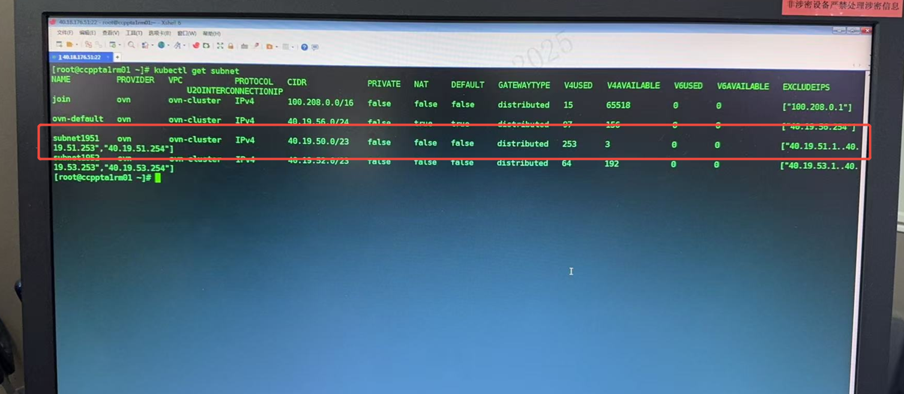

---
kind:
  - Troubleshooting
products:
  - Alauda Container Platform
  - Alauda DevOps
  - Alauda AI
  - Alauda Application Services
  - Alauda Service Mesh
  - Alauda Developer Portal
ProductsVersion:
  - 4.1.0,4.2.x
---
<!-- A type of document that involves encountering a fault, diagnosing it, performing root cause analysis, and providing solutions. -->

# 容器平台,网络, Kube

Pod无法获取IP地址 影响特定节点的Pod网络功能

## Cause
- StatefulSet资源更新/取消固定IP设置时ovn-controller未释放IP
- 子网剩余IP检测逻辑与实际可用IP不一致

## Resolution
- 手动重启ovn-controller服务pod释放IP
- 设置StatefulSet固定IP前先停止服务

## [workaround]
- 在对StatefulSet进行固定IP设置前停止服务

## [Related Information]
**Screenshots**

- Environment: v3.12.4
- 子网分配顺序
- ovn-controller
- StatefulSet资源
- 固定IP设置
- Component: 用户
- Page ID: 310575566
- Original Title: 容器平台,网络, Kube-OVN-pod无法获取IP-109588-zh
