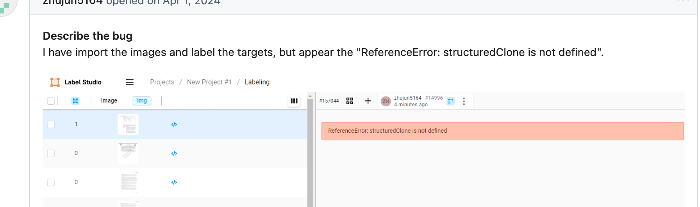
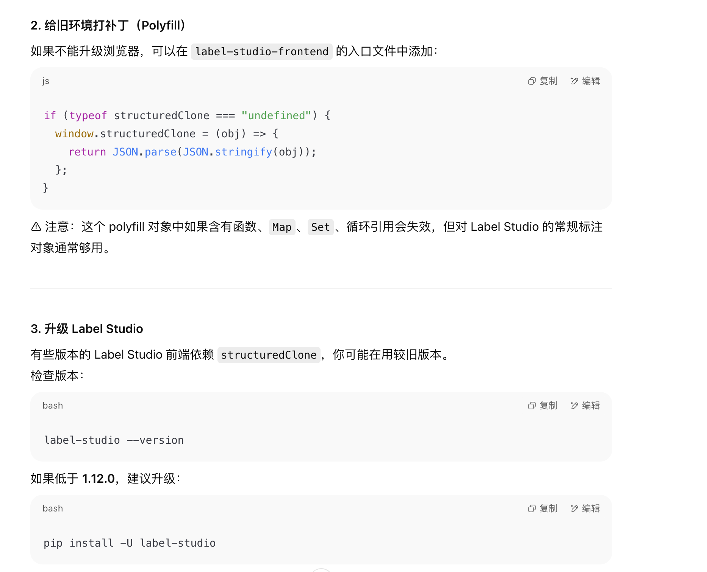
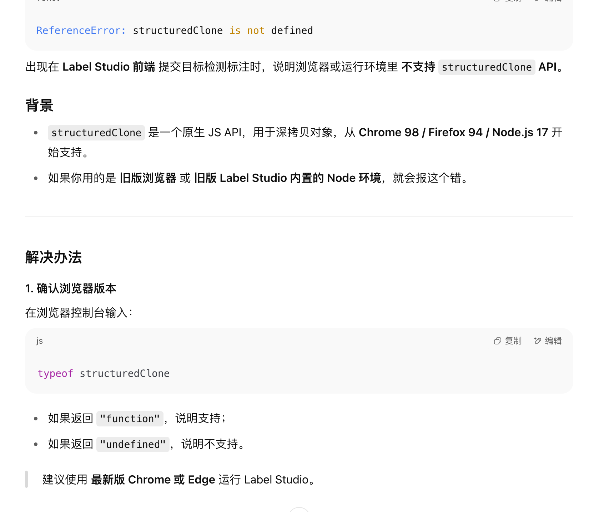

---
kind:
  - Troubleshooting
products:
  - Alauda Container Platform
  - Alauda DevOps
  - Alauda AI
  - Alauda Application Services
  - Alauda Service Mesh
  - Alauda Developer Portal
ProductsVersion:
  - 4.1.0,4.2.x
---
<!-- A type of document that involves encountering a fault, diagnosing it, performing root cause analysis, and providing solutions. -->

# 目标检测标注画完框提交后就报这个错

目标检测标注画完框提交后报错

## Cause
- Google版本过低

## Resolution
- 升级Google版本或更换浏览器

## [workaround]

## [Related Information]
**Screenshots**

- Environment: Label Studio 3.18.1
- label-studio
- 浏览器
- Component: 用户
- Page ID: 323682766
- Original Title: 微服务-AI-目标检测标注画完框提交后就报这个错-113788
