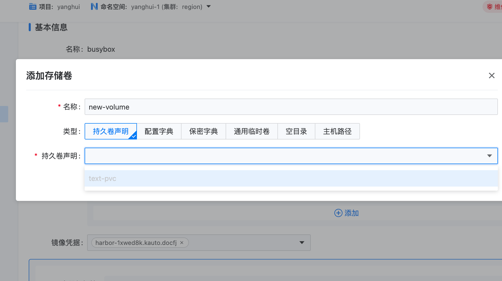
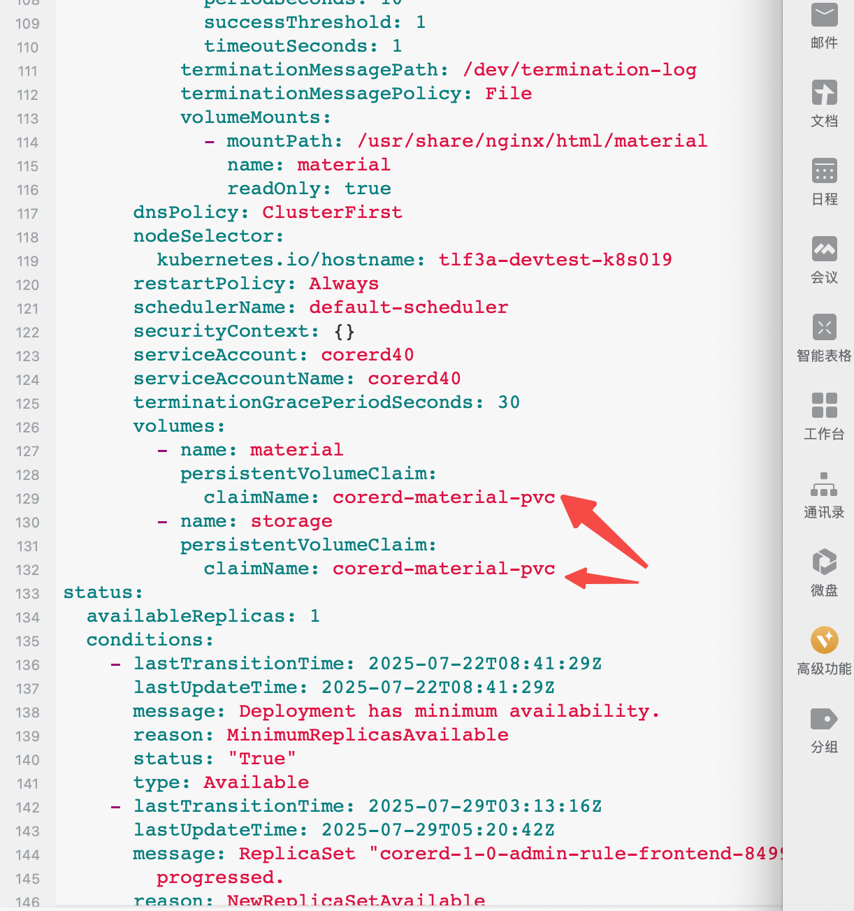

---
kind:
  - Troubleshooting
products:
  - Alauda Container Platform
  - Alauda DevOps
  - Alauda AI
  - Alauda Application Services
  - Alauda Service Mesh
  - Alauda Developer Portal
ProductsVersion:
  - 4.1.0,4.2.x
---
<!-- A type of document that involves encountering a fault, diagnosing it, performing root cause analysis, and providing solutions. -->

# pod起不来，事件上看无异常

pod起不来 事件上看无异常

## Cause
- 两个不同名字的卷绑定了同一个pvc

## Resolution
- 删除重复的卷条目
- 确保不同卷引用不同的pvc

## [workaround]

## [Related Information]
**Screenshots**

- Environment: 3.18.1
- pvc
- volumes配置
- yaml
- Component: 用户
- Page ID: 323682779
- Original Title: 容器平台-应用管理-pod起不来，事件上看无异常-113992
