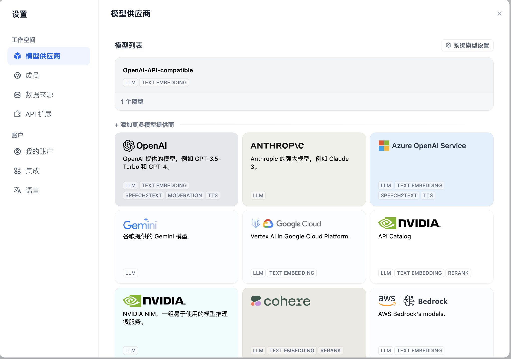
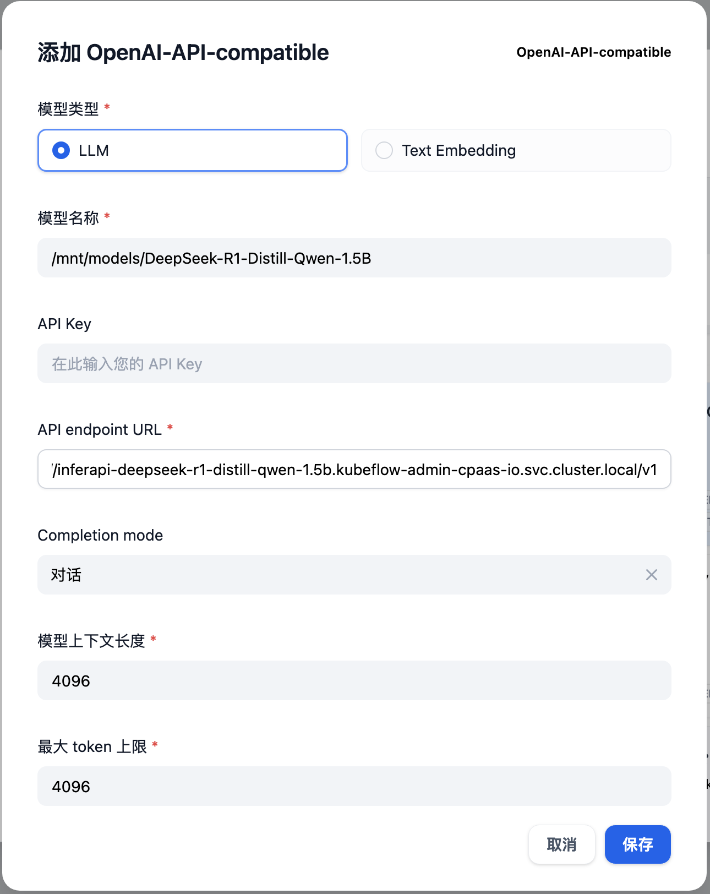

---
kind:
  - Troubleshooting
products:
  - Alauda Container Platform
  - Alauda DevOps
  - Alauda AI
  - Alauda Application Services
  - Alauda Service Mesh
  - Alauda Developer Portal
ProductsVersion:
  - 4.1.0,4.2.x
---
<!-- A type of document that involves encountering a fault, diagnosing it, performing root cause analysis, and providing solutions. -->

# dify工作流使用AML本地模型失败

dify工作流使用AML本地模型失败

## Cause
- 模型名称未采用固定格式【/mnt/models/】+模型原始名称
- API endpoint URL未按格式添加/v1后缀或未正确选择集群内外访问地址
- Dify与AML服务未部署在同一集群却使用集群内访问地址

## Resolution
- 模型名称按【/mnt/models/模型原始名称】格式填写
- OpenAI-API-compatible类型需在集群内访问地址后加/v1
- AML供应商类型直接使用原始集群内访问地址
- 跨集群访问需配置集群外访问域名

## [workaround]

## [Related Information]
**Screenshots**

- Environment: 3.16.2
- AML供应商
- OpenAI-API-compatible
- /mnt/models/
- API endpoint URL
- 集群内访问地址
- 模型类型(LLM)
- Component: 用户
- Page ID: 324174431
- Original Title: 微服务-AI-dify工作流使用AML本地模型失败-113464
