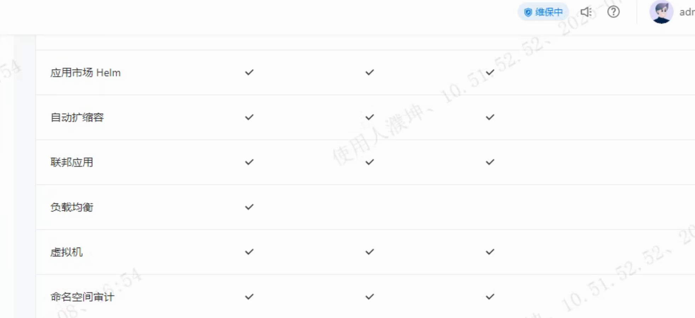

---
kind:
  - Troubleshooting
products:
  - Alauda Container Platform
  - Alauda DevOps
  - Alauda AI
  - Alauda Application Services
  - Alauda Service Mesh
  - Alauda Developer Portal
ProductsVersion:
  - 4.1.0,4.2.x
---
<!-- A type of document that involves encountering a fault, diagnosing it, performing root cause analysis, and providing solutions. -->

# 子用户无法操作更新弹性伸缩

子用户无法操作更新弹性伸缩

## Cause
- 子用户未勾选自动扩缩容管理的删除权限

## Resolution
- 在角色权限中为子用户勾选自动扩缩容管理的删除权限

## [workaround]

## [Related Information]
**Screenshots**

- Environment: 3.16.2
- 自动扩缩容管理
- 角色权限配置
- 删除权限
- Component: 用户
- Page ID: 330465940
- Original Title: 基础架构-子用户无法操作更新弹性伸缩-112489
