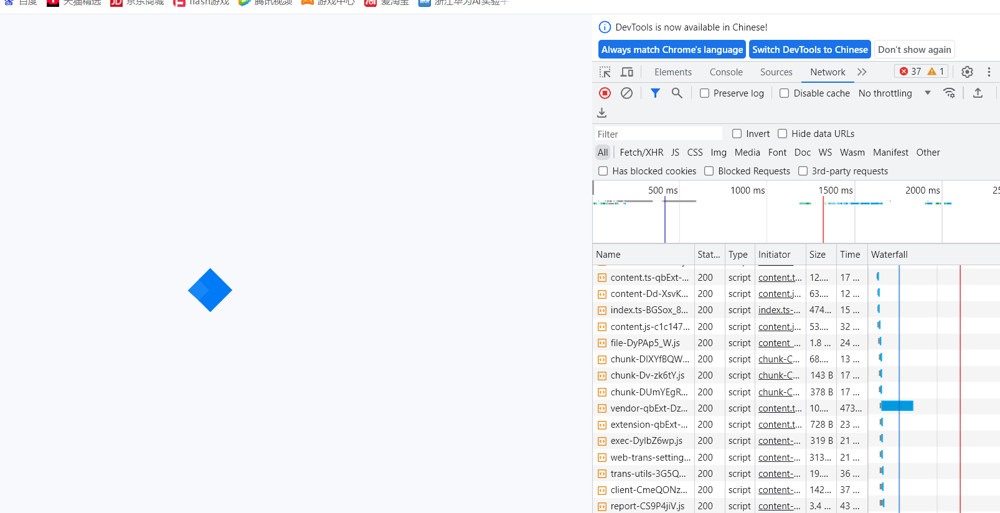
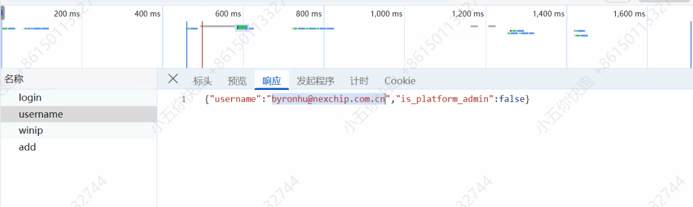
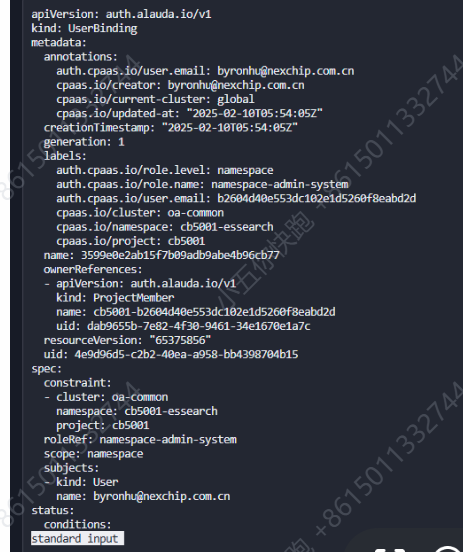
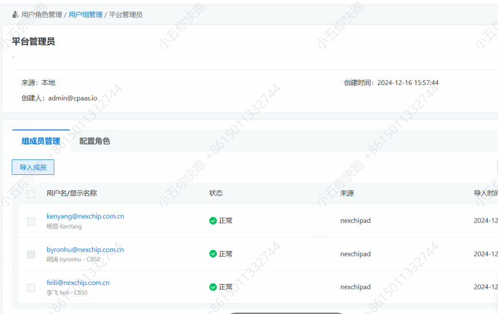

---
kind:
  - Troubleshooting
products:
  - Alauda Container Platform
  - Alauda DevOps
  - Alauda AI
  - Alauda Application Services
  - Alauda Service Mesh
  - Alauda Developer Portal
ProductsVersion:
  - 4.1.0,4.2.x
---
<!-- A type of document that involves encountering a fault, diagnosing it, performing root cause analysis, and providing solutions. -->

# 智能文档查看问答数据

智能文档查看问答数据提示没有权限 用户属于平台管理员用户组但被拒绝访问

## Cause
- 问答数据页面要求用户所属用户组的roleRef必须为platform-admin-system
- 通过idp对接的第三方用户虽然具有平台管理员权限但未满足特定roleRef要求

## Resolution
- 确保用户所属用户组的roleRef属性设置为platform-admin-system

## [workaround]

## [Related Information]
**Screenshots**

2.检查接口返回数据，发现对于用户权限存在检查
3.此用户为通过idp对接的第三方用户，在一个具有平台管理员权限的用户组内，而问答数据页面要求roleRef必须为platform-admin-system 

- Environment: 3.18.1
- idp
- 用户组配置
- roleRef
- platform-admin-system
- Component: 用户
- Page ID: 336396990
- Original Title: 微服务-AI-智能文档查看问答数据-115531
