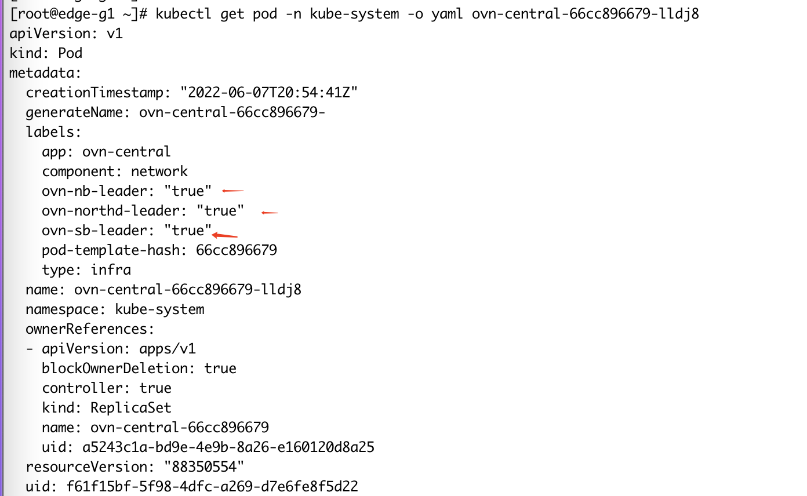
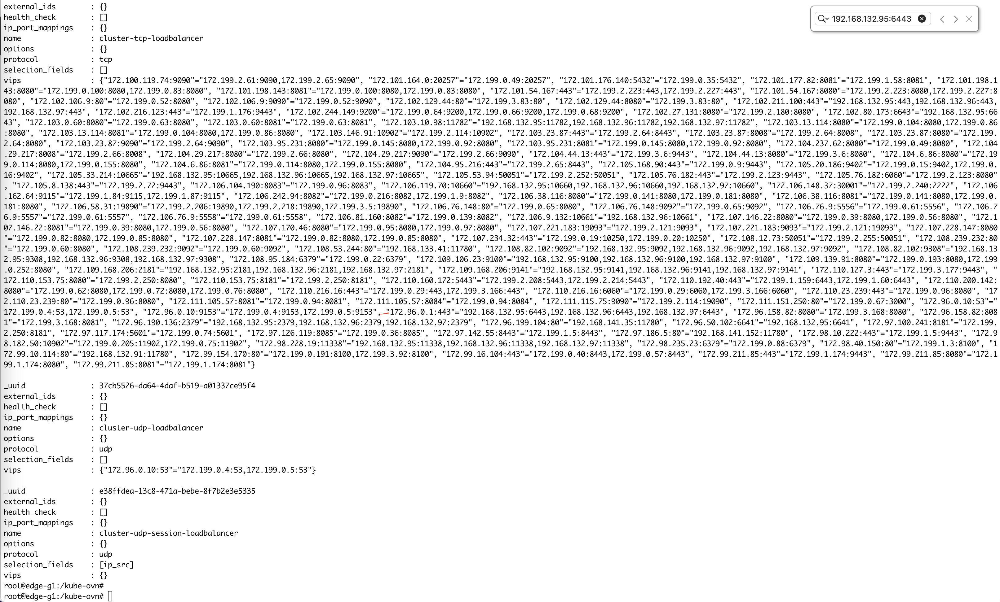

---
kind:
  - Troubleshooting
products:
  - Alauda Container Platform
  - Alauda DevOps
  - Alauda AI
  - Alauda Application Services
  - Alauda Service Mesh
  - Alauda Developer Portal
ProductsVersion:
  - 4.1.0,4.2.x
---
<!-- A type of document that involves encountering a fault, diagnosing it, performing root cause analysis, and providing solutions. -->

# 20220608 Edge环境，升级到ACP3.9.0版本，出现ovn

ovn-central pod处于0/1 Running状态 大量应用Pod启动失败 svc endpoints无有效数据

## Cause
- ovn-central readiness检查脚本在添加label阶段耗时过长导致状态更新延迟

## Resolution
- 重建ovn-central和ovs-ovn的pod

## [workaround]

## [Related Information]
**Screenshots**

- Environment: ACP 3.9 + Kube-OVN v1.9.3
- ovn-central
- ovs-ovn
- kube-ovn
- svc
- endpoints
- readiness检查脚本
- Component: 升级
- Page ID: 115530906
- Original Title: 20220608 Edge环境，升级到ACP3.9.0版本，出现ovn-central 状态显示异常的问题
