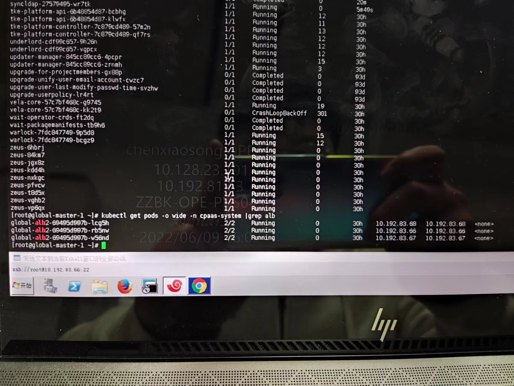

---
kind:
  - Troubleshooting
products:
  - Alauda Container Platform
  - Alauda DevOps
  - Alauda AI
  - Alauda Application Services
  - Alauda Service Mesh
  - Alauda Developer Portal
ProductsVersion:
  - 4.1.0,4.2.x
---
<!-- A type of document that involves encountering a fault, diagnosing it, performing root cause analysis, and providing solutions. -->

# 20220610

ovn-central pod状态异常 66 master节点磁盘满，清理后kube-ovn-cni pod仍异常 kube-ovn-cni pod readiness检查失败，但手动执行检查成功

## Cause
- ovn-central的NB/SB数据库中存在66节点的多余记录

## Resolution
- 删除ovn-central数据库中的多余记录

## [workaround]
- 移动异常pod所在节点的db文件并重启pod

## [Related Information]
**Screenshots**

- Environment: ACP3.6升级到ACP3.8.1版本，CNI版本1.8.5
- kube-ovn-cni
- ovn-central
- NB/SB数据库
- 10665端口
- Component: 升级
- Page ID: 115532283
- Original Title: 20220610-郑州银行ACP3.6升级ACP3.8，Global集群 kube-ovn-cni pod状态异常
