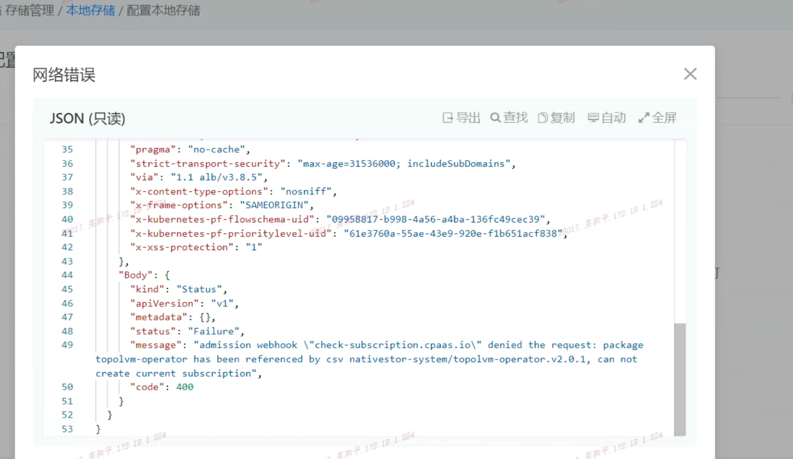

---
kind:
  - Troubleshooting
products:
  - Alauda Container Platform
  - Alauda DevOps
  - Alauda AI
  - Alauda Application Services
  - Alauda Service Mesh
  - Alauda Developer Portal
ProductsVersion:
  - 4.1.0,4.2.x
---
<!-- A type of document that involves encountering a fault, diagnosing it, performing root cause analysis, and providing solutions. -->

# 3.8.1

创建本地存储时报错 跳转至部署topolvm operator页面后部署失败 topolvm的Subscription未被生成

## Cause
- CSV资源可能处于异常状态导致olm无法正确创建Subscription

## Resolution
- kubectl delete csv -n nativestore-system topolvm-operator-xxxxx

## [workaround]
- 强制删除CSV触发olm重新创建资源

## [Related Information]
**Screenshots**

- Environment: TKE 3.8.1
- olm
- topolvm-operator
- Subscription
- InstallPlan
- nativestore-system
- Component: 升级
- Page ID: 115536856
- Original Title: 3.8.1-创建本地存储topolvm页面报错
