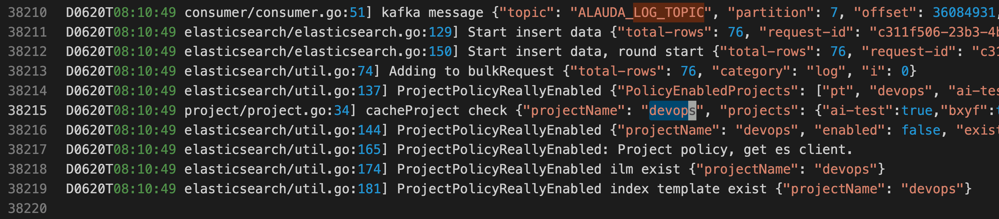
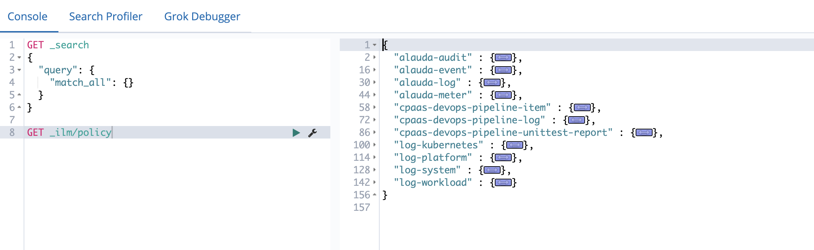
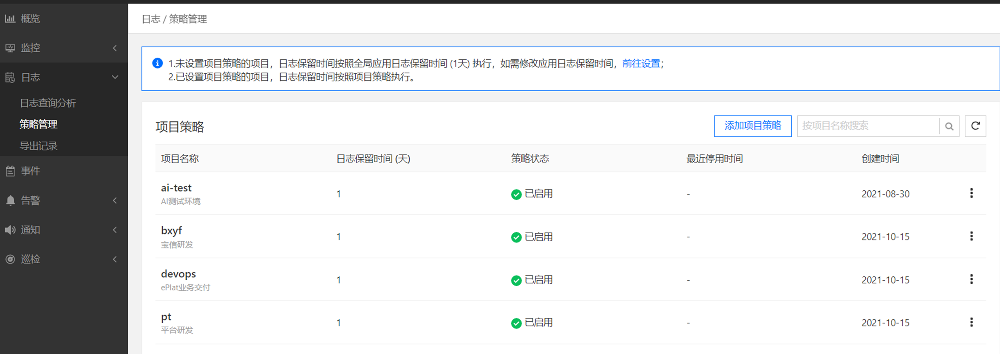

---
kind:
  - Troubleshooting
products:
  - Alauda Container Platform
  - Alauda DevOps
  - Alauda AI
  - Alauda Application Services
  - Alauda Service Mesh
  - Alauda Developer Portal
ProductsVersion:
  - 4.1.0,4.2.x
---
<!-- A type of document that involves encountering a fault, diagnosing it, performing root cause analysis, and providing solutions. -->

# 3.6.2

lanaya无法将日志写入es，重启服务后短暂恢复但写入量少 lanaya的debug日志显示报错，涉及特定项目名称(devops) 存在devops项目的单独日志采集策略

## Cause
- lanaya服务在处理devops项目日志时出现判断错误
- 特定项目(devops)的日志采集策略触发服务bug

## Resolution
- 临时方案：通过日志策略管理界面停用devops项目的采集策略
- 彻底解决：升级平台至3.8+版本

## [workaround]
- 停用devops项目的日志采集策略

## [Related Information]
**Screenshots**

- Environment: 3.6.2
- devops
- 日志采集策略
- lanaya
- es
- kibana
- Component: 升级
- Page ID: 120099394
- Original Title: 3.6.2-日志-lanaya无法将日志写入es-项目日志采集策略
