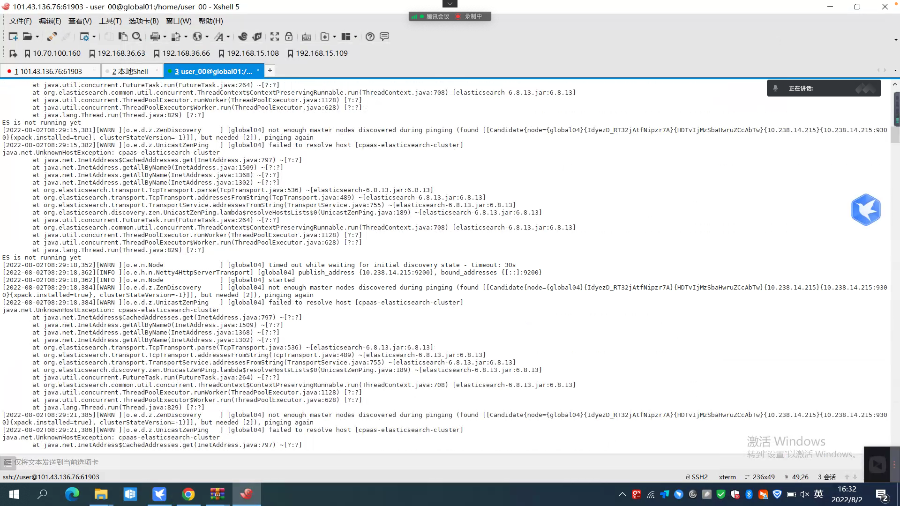

---
kind:
  - Troubleshooting
products:
  - Alauda Container Platform
  - Alauda DevOps
  - Alauda AI
  - Alauda Application Services
  - Alauda Service Mesh
  - Alauda Developer Portal
ProductsVersion:
  - 4.1.0,4.2.x
---
<!-- A type of document that involves encountering a fault, diagnosing it, performing root cause analysis, and providing solutions. -->

# 3.4

curl health接口返回503 日志报错java.net.UnknownHostException: cpaas-elesticsearch-cluster

## Cause
- 升级后elasticsearch使用了旧版本hostnetwork模式配置
- hostnetwork模式导致集群内部名称解析失败

## Resolution
- 删除elasticsearch yaml配置中的hostnetwork字段

## [workaround]

## [Related Information]
**Screenshots**

- Environment: 通用
- hostNetwork配置
- elasticsearch.yaml
- Component: 升级
- Page ID: 120122151
- Original Title: 3.4-elasticsearch无法启动
