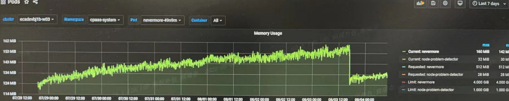

---
kind:
  - Troubleshooting
products:
  - Alauda Container Platform
  - Alauda DevOps
  - Alauda AI
  - Alauda Application Services
  - Alauda Service Mesh
  - Alauda Developer Portal
ProductsVersion:
  - 4.1.0,4.2.x
---
<!-- A type of document that involves encountering a fault, diagnosing it, performing root cause analysis, and providing solutions. -->

# 3.8.0

内存泄漏导致oom

## Cause
- 审计首字母大写引起的内存溢出

## Resolution
- 升级平台版本至3.8.2

## [workaround]

## [Related Information]
**Screenshots**

- Environment: 3.8
- Component: 升级
- Page ID: 120126418
- Original Title: 3.8.0-nevermore内存泄漏问题
