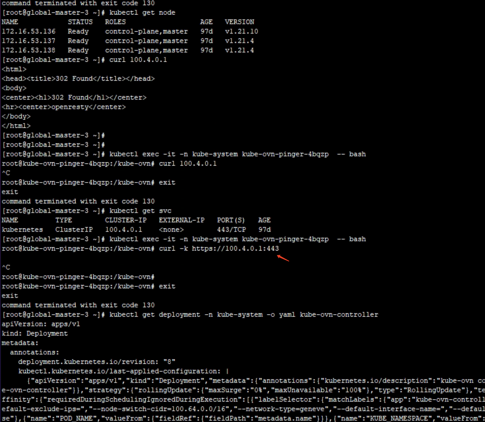
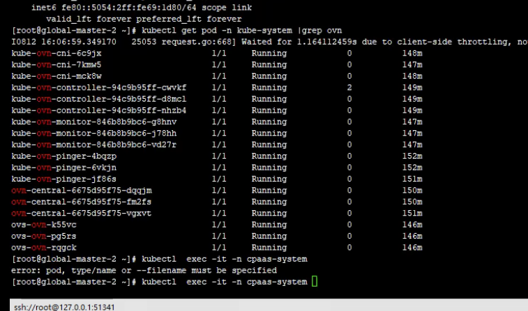
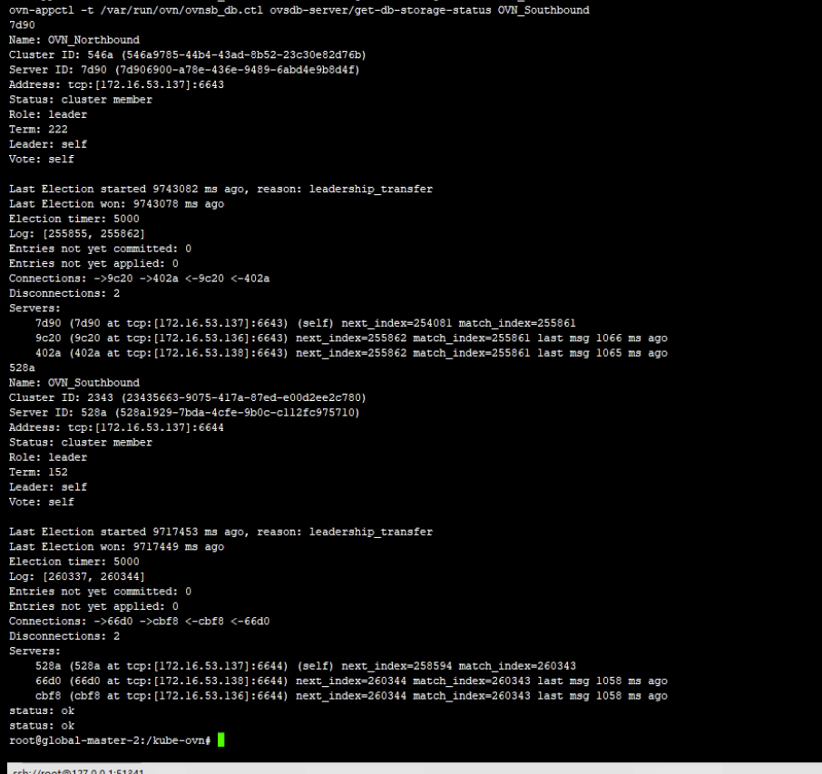
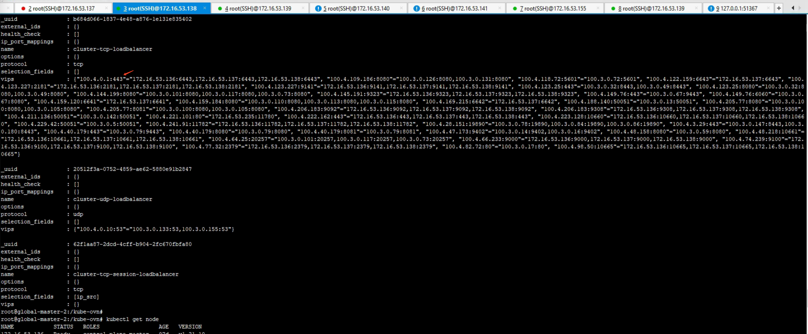
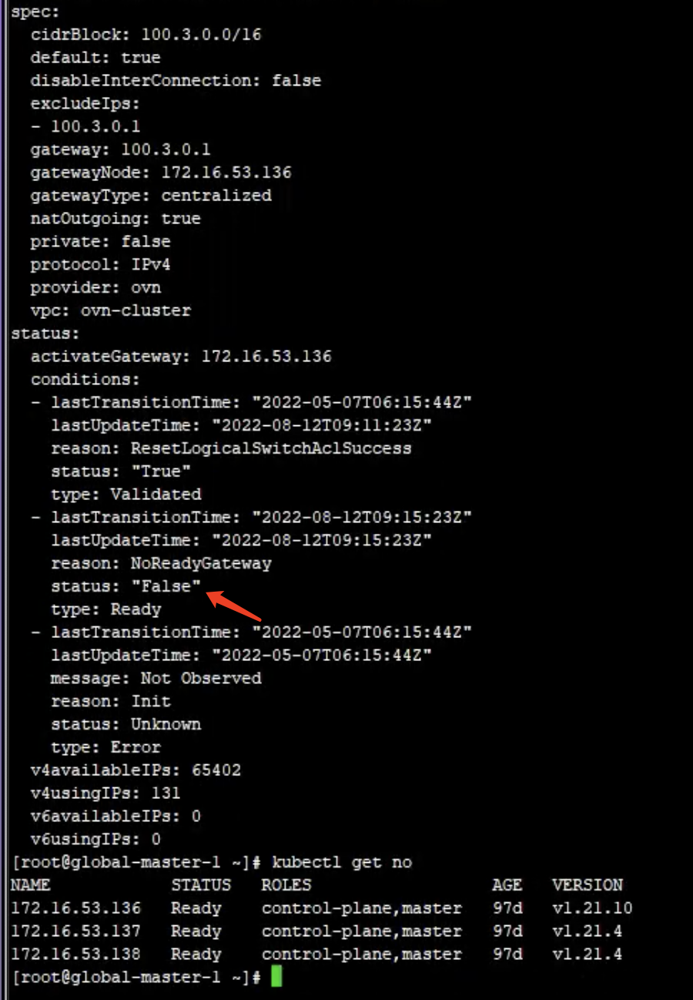
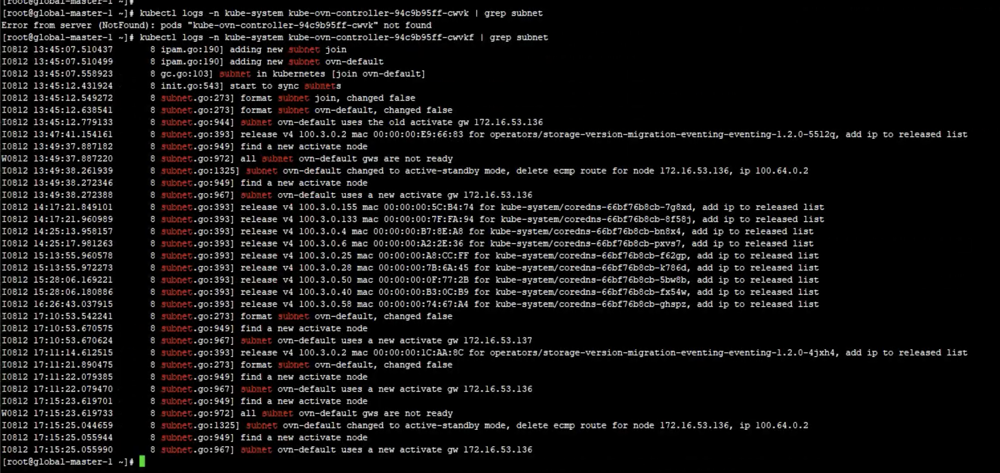
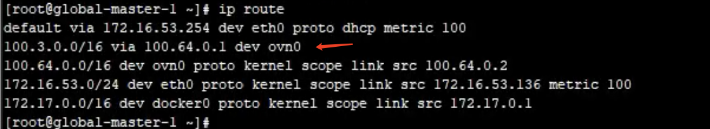
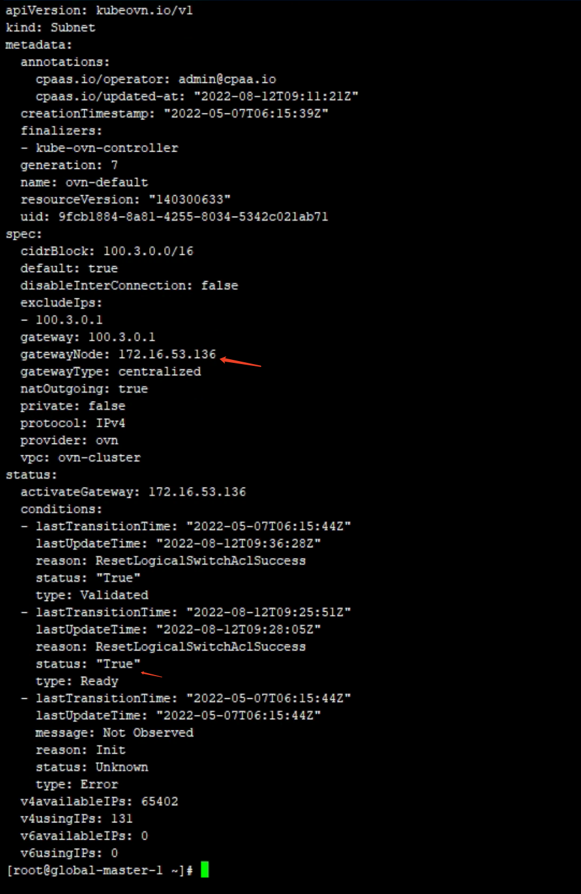

---
kind:
  - Troubleshooting
products:
  - Alauda Container Platform
  - Alauda DevOps
  - Alauda AI
  - Alauda Application Services
  - Alauda Service Mesh
  - Alauda Developer Portal
ProductsVersion:
  - 4.1.0,4.2.x
---
<!-- A type of document that involves encountering a fault, diagnosing it, performing root cause analysis, and providing solutions. -->

# 2022

容器网络无法访问svc地址和apiserver 节点访问pod网络不通，本节点网络也不通 subnet的status.ready状态为false

## Cause
- subnet网关节点信息未正确配置
- kube-ovn-controller未自动更新subnet状态

## Resolution
- 手动更新subnet的spec.gatewayNode字段，指定其他可用节点

## [workaround]

## [Related Information]
**Screenshots**

- Environment: Kube-OVN v1.8.9
- kube-ovn-controller
- subnet CRD
- ovn0网卡
- 集中式网关
- spec.gatewayNode
- Component: 升级
- Page ID: 120127419
- Original Title: 2022-8-12 微盟3.6升级3.8.2，集中式网关访问异常
