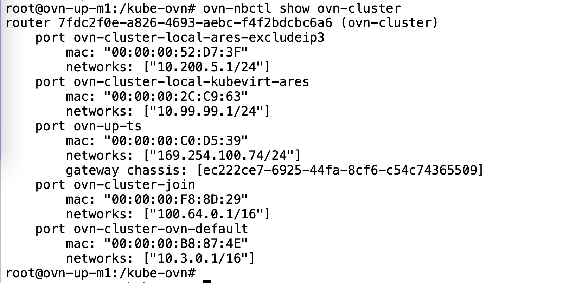

---
kind:
  - Troubleshooting
products:
  - Alauda Container Platform
  - Alauda DevOps
  - Alauda AI
  - Alauda Application Services
  - Alauda Service Mesh
  - Alauda Developer Portal
ProductsVersion:
  - 4.1.0,4.2.x
---
<!-- A type of document that involves encountering a fault, diagnosing it, performing root cause analysis, and providing solutions. -->

# 2022

业务pod启动报错，网关地址不通 OVS日志无具体报错但trace出现报错 删除ovs pod重建无效

## Cause
- ovs db存在异常导致网络配置错误

## Resolution
- 重置ovn db恢复环境

## [workaround]

## [Related Information]
**Screenshots**

- Environment: Kubernetes overlay集群(3.8.2升级至3.10)
- ovn-cluster
- ovn-default
- ovs db
- Component: 升级
- Page ID: 127403912
- Original Title: 2022-09-24 ACP发版，逐步升级环境
