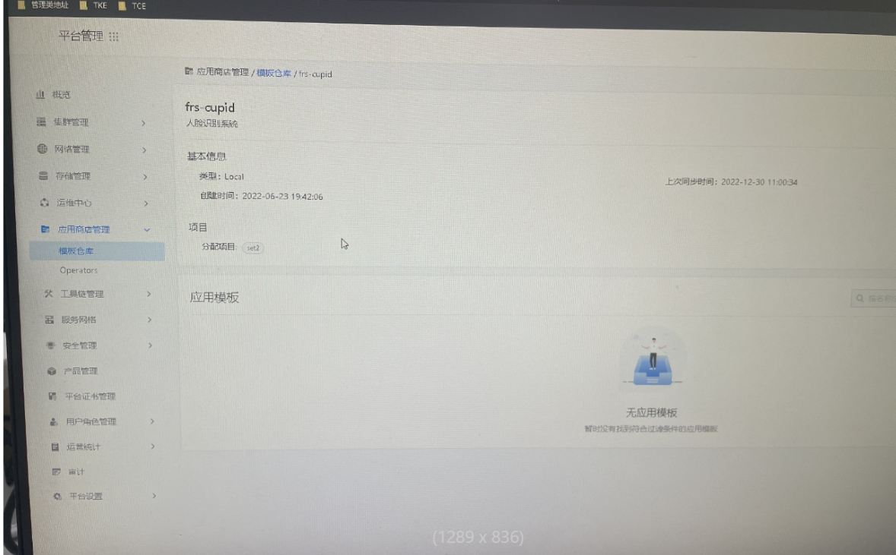
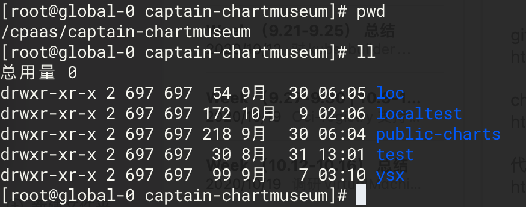

---
kind:
  - Troubleshooting
products:
  - Alauda Container Platform
  - Alauda DevOps
  - Alauda AI
  - Alauda Application Services
  - Alauda Service Mesh
  - Alauda Developer Portal
ProductsVersion:
  - 4.1.0,4.2.x
---
<!-- A type of document that involves encountering a fault, diagnosing it, performing root cause analysis, and providing solutions. -->

# 升级后本地类型模板仓库中的模板丢失

升级后本地类型模板仓库中的模板丢失 查询本地模板仓库时显示不存在

## Cause
- captain-chartmuseum组件Pod漂移到新节点后，新节点hostpath目录不存在历史数据

## Resolution
- kubectl get pod -n cpaas-system -o wide | grep captain-chartmuseum 查找当前Pod所在节点
- 检查其他master节点的/cpaas/captain-chartmuseum目录找回数据
- 使用 scp -r /cpaas/captain-chartmuseum/ root@global-1:/cpaas/ 复制数据到当前节点

## [workaround]

## [Related Information]
**Screenshots**

- Environment: TKE高可用环境（global集群含至少3个master节点）
- captain-chartmuseum
- /cpaas/captain-chartmuseum
- Component: 升级
- Page ID: 133090559
- Original Title: 升级后本地类型模板仓库中的模板丢失
