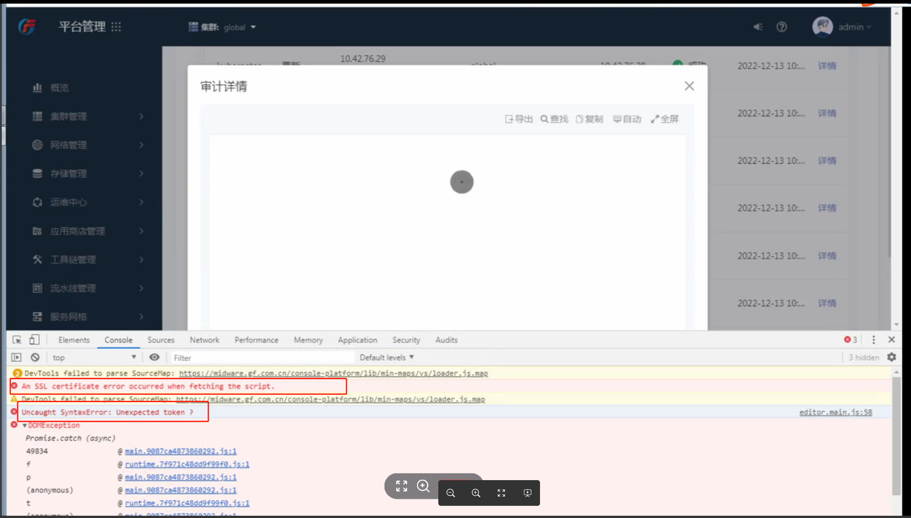

---
kind:
  - Troubleshooting
products:
  - Alauda Container Platform
  - Alauda DevOps
  - Alauda AI
  - Alauda Application Services
  - Alauda Service Mesh
  - Alauda Developer Portal
ProductsVersion:
  - 4.1.0,4.2.x
---
<!-- A type of document that involves encountering a fault, diagnosing it, performing root cause analysis, and providing solutions. -->

# 3.8.1cce平台

审计详情、operator详情无法加载 浏览器开发者工具未发现请求错误

## Cause
- Chrome 69版本兼容性问题

## Resolution
- 升级至最新版本Chrome浏览器

## [workaround]

## [Related Information]
**Screenshots**

- Environment: 3.8.1-cce
- icarus underlord服务
- 审计详情
- Component: 升级
- Page ID: 133097557
- Original Title: 3.8.1cce平台-审计详情/operator详情无法加载-浏览器版本导致
