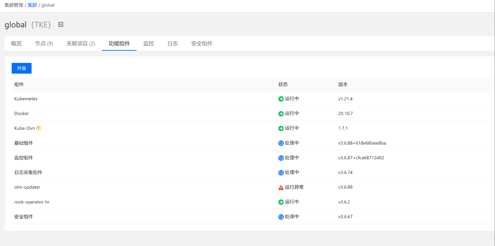
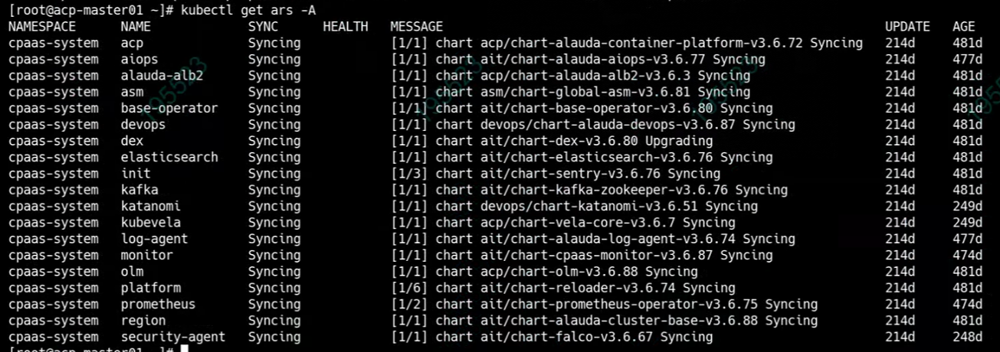
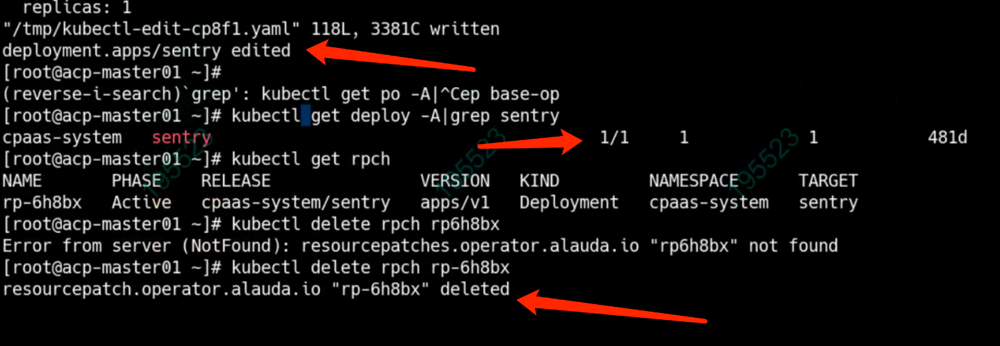

---
kind:
  - Troubleshooting
products:
  - Alauda Container Platform
  - Alauda DevOps
  - Alauda AI
  - Alauda Application Services
  - Alauda Service Mesh
  - Alauda Developer Portal
ProductsVersion:
  - 4.1.0,4.2.x
---
<!-- A type of document that involves encountering a fault, diagnosing it, performing root cause analysis, and providing solutions. -->

# global集群基础功能组件一直处于处理中状态

global集群基础功能组件一直处于处理中状态 ars状态异常(syncing) sentry副本数为0

## Cause
- 产品设计缺陷导致sentry deployment变更时被记录到rpch
- rpch记录阻止sentry组件正常拉起

## Resolution
- 删除记录sentry副本的rpch资源

## [workaround]

## [Related Information]
**Screenshots**

- Environment: TKE 3.6
- sentry
- rpch
- ars
- deployment
- Component: 升级
- Page ID: 140806497
- Original Title: global集群基础功能组件一直处于处理中状态
