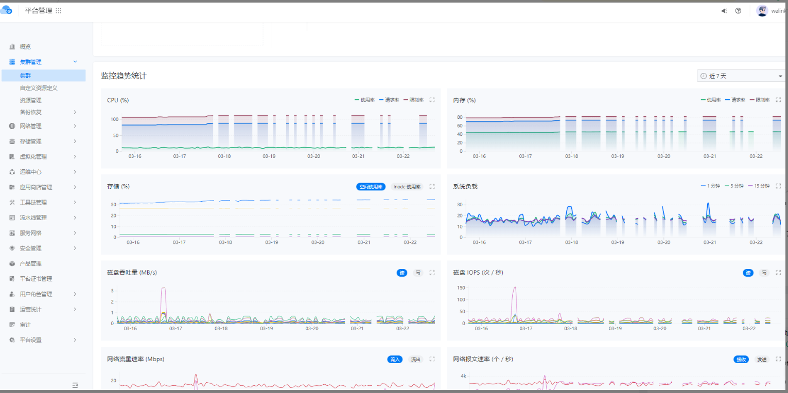

---
kind:
  - Troubleshooting
products:
  - Alauda Container Platform
  - Alauda DevOps
  - Alauda AI
  - Alauda Application Services
  - Alauda Service Mesh
  - Alauda Developer Portal
ProductsVersion:
  - 4.1.0,4.2.x
---
<!-- A type of document that involves encountering a fault, diagnosing it, performing root cause analysis, and providing solutions. -->

# 集群节点监控信息断续

集群节点监控信息断续

## Cause
- 历史遗留问题（一直存在的bug）

## Resolution
- 升级平台版本至3.12版本解决

## [workaround]
- 临时重启对应集群kube-prometheus-exporter-kube-state服务

## [Related Information]
**Screenshots**

- Environment: prometheus:v3.10.65-3b9f84e0f727
- kube-prometheus-exporter-kube-state
- Component: 升级
- Page ID: 140822660
- Original Title: 集群节点监控信息断续
