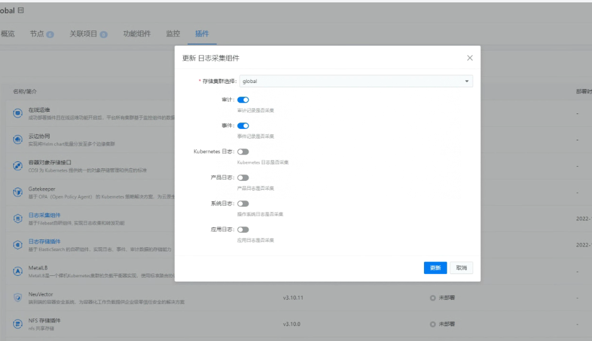

---
kind:
  - Troubleshooting
products:
  - Alauda Container Platform
  - Alauda DevOps
  - Alauda AI
  - Alauda Application Services
  - Alauda Service Mesh
  - Alauda Developer Portal
ProductsVersion:
  - 4.1.0,4.2.x
---
<!-- A type of document that involves encountering a fault, diagnosing it, performing root cause analysis, and providing solutions. -->

# 3.10.1

健康探测audit目录不存在 频繁触发组件重启

## Cause
- 节点内缺少audit.log结尾的日志文件
- nevermore组件存在未勾选的日志类型配置

## Resolution
- 临时方案：在配置中勾选全部日志类型
- 永久方案：升级平台版本至3.12

## [workaround]

## [Related Information]
**Screenshots**

- Environment: 3.10.1
- /var/log/audit/audit.log
- nevermore日志采集配置
- 组件健康检查机制
- Component: 升级
- Page ID: 146360503
- Original Title: 3.10.1-nevermore健康探测audit目录不存在，频繁触发组件重启
