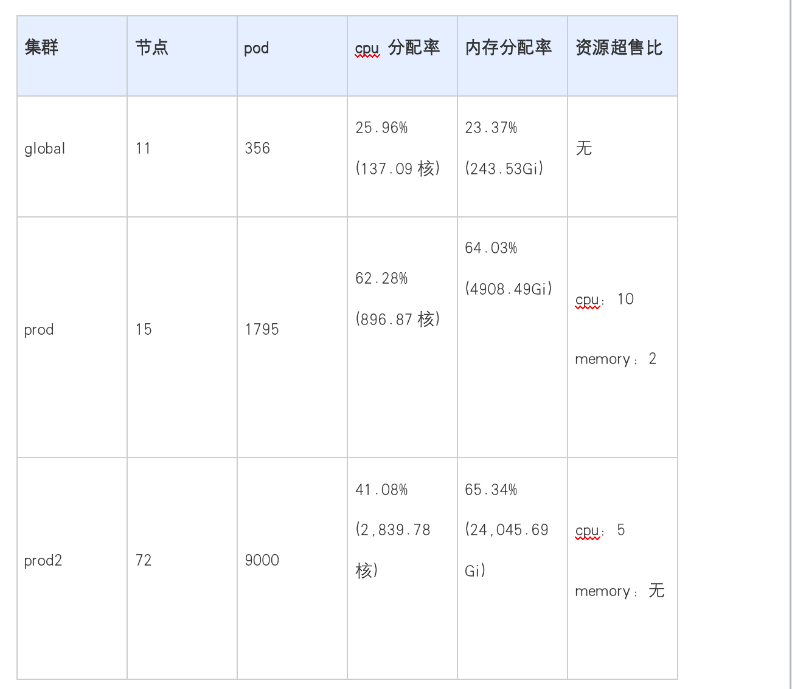
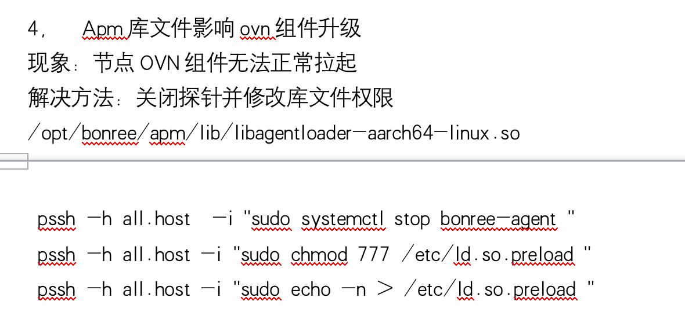
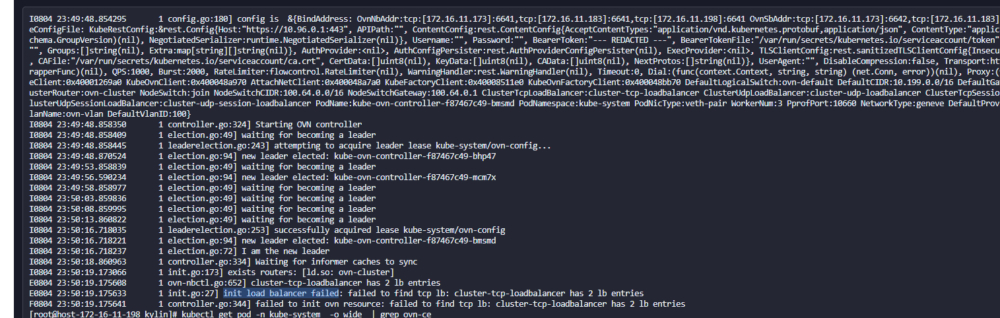
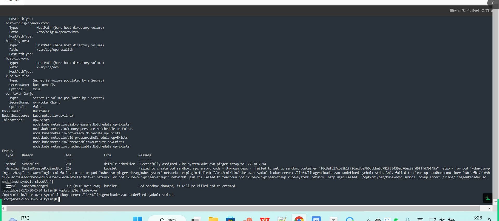
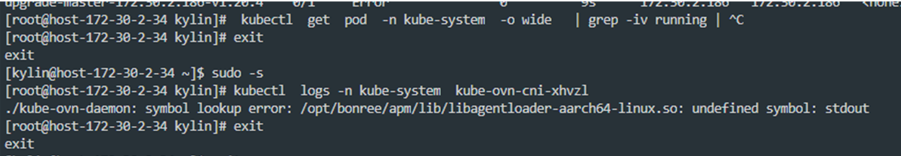
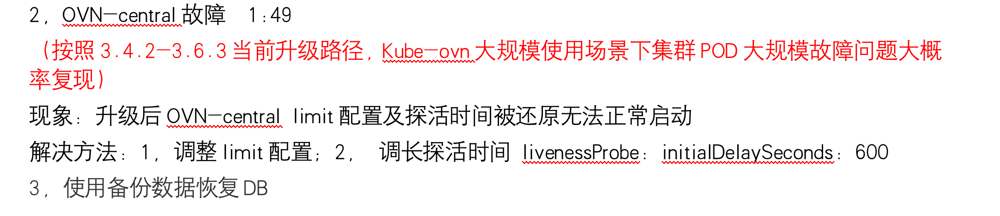
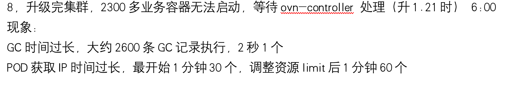
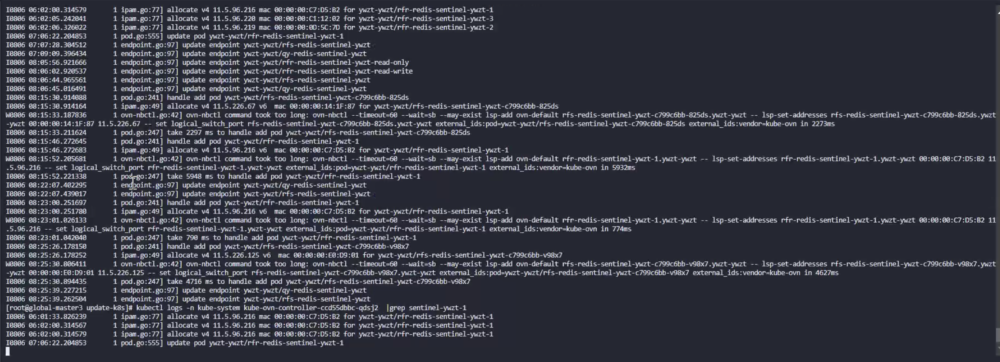

---
kind:
  - Troubleshooting
products:
  - Alauda Container Platform
  - Alauda DevOps
  - Alauda AI
  - Alauda Application Services
  - Alauda Service Mesh
  - Alauda Developer Portal
ProductsVersion:
  - 4.1.0,4.2.x
---
<!-- A type of document that involves encountering a fault, diagnosing it, performing root cause analysis, and providing solutions. -->

# 广西办公厅3.4.2 升级3.6.2 问题记录

kube-ovn-controller 启动报错提示有多余 lb 记录但实际数据库不存在 prod2 集群升级时数据库无 leader 状态 ovn-central 异常导致 ovs-ovn crash

## Cause
- kylin 系统 bornee 插件影响 so 文件
- 数据库存在多余记录未清理
- ovn-central 异常触发健康检查失败（1.8 前版本问题）
- 大规模集群下默认资源配置不足
- 升级流程未保留原有资源配置

## Resolution
- 禁用或更新 bornee 插件
- 删除数据库多余记录
- 升级 kube-ovn 到 1.8+ 版本
- 优化 gc 流程使其不阻塞初始化
- 保留升级前资源配置

## [workaround]
- 手动恢复数据库
- 临时调整 kube-ovn-controller 资源配额

## [Related Information]
**Screenshots**

- Environment: kylin 系统, Kubernetes, kube-ovn 1.6.3 升级至 1.7.1, ACP v3.6.2
- kube-ovn-controller
- ovn-central
- nbctl
- kube-ovn ipam/gc 流程
- bornee 插件
- Component: 升级
- Page ID: 155327346
- Original Title: 广西办公厅3.4.2 升级3.6.2 问题记录
