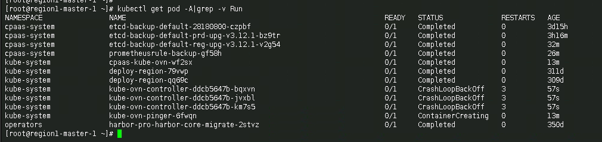
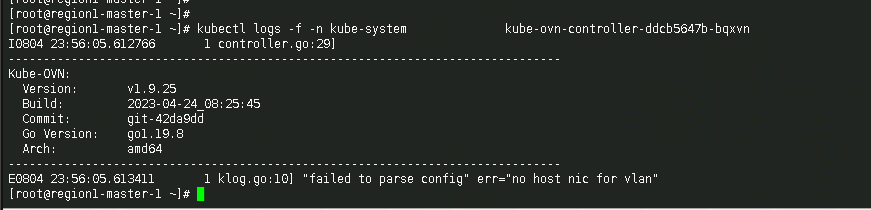
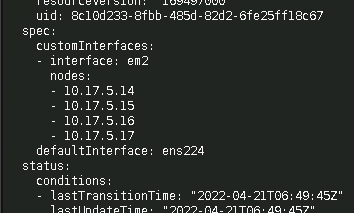
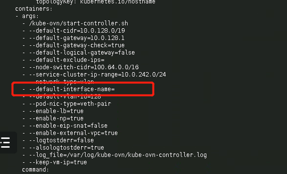

---
kind:
  - Troubleshooting
products:
  - Alauda Container Platform
  - Alauda DevOps
  - Alauda AI
  - Alauda Application Services
  - Alauda Service Mesh
  - Alauda Developer Portal
ProductsVersion:
  - 4.1.0,4.2.x
---
<!-- A type of document that involves encountering a fault, diagnosing it, performing root cause analysis, and providing solutions. -->

# 合众人寿underlay 升级

kube-ovn-controller crash parameter validation failure in logs

## Cause
- empty parameters during underlay upgrade caused validation failure

## Resolution
- manual intervention to handle empty parameters

## [workaround]

## [Related Information]
**Screenshots**

- Environment: Kubernetes with Kube-OVN CNI (1.8 upgraded to 1.9), ACP upgraded from v3.8 to 3.12.1 via 3.10
- kube-ovn-controller
- underlay network interface configuration
- Component: 升级
- Page ID: 155327478
- Original Title: 合众人寿underlay 升级
