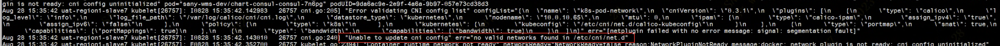
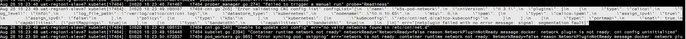
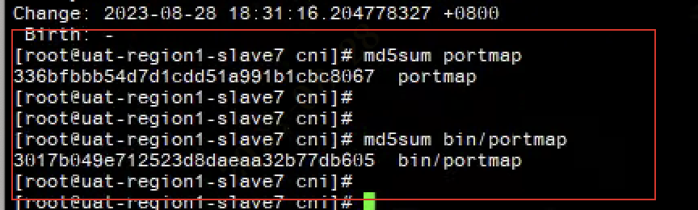

---
kind:
  - Troubleshooting
products:
  - Alauda Container Platform
  - Alauda DevOps
  - Alauda AI
  - Alauda Application Services
  - Alauda Service Mesh
  - Alauda Developer Portal
ProductsVersion:
  - 4.1.0,4.2.x
---
<!-- A type of document that involves encountering a fault, diagnosing it, performing root cause analysis, and providing solutions. -->

# 集群升级时某个节点 NotReady：no valid networks found in /etc/cni/net.d

节点处于 NotReady 状态 kubelet 报错 no valid networks found in /etc/cni/net.d kubelet 日志中存在 segmentation fault

## Cause
- portmap 的 MD5 校验值与其他正常节点不一致

## Resolution
- 从正常节点拷贝 portmap 到故障节点

## [workaround]

## [Related Information]
**Screenshots**

- /etc/cni/net.d
- kubelet
- calico
- CNI
- portmap
- bandwidth
- Component: 升级
- Page ID: 161393116
- Original Title: 集群升级时某个节点 NotReady：no valid networks found in /etc/cni/net.d
