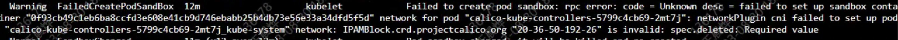
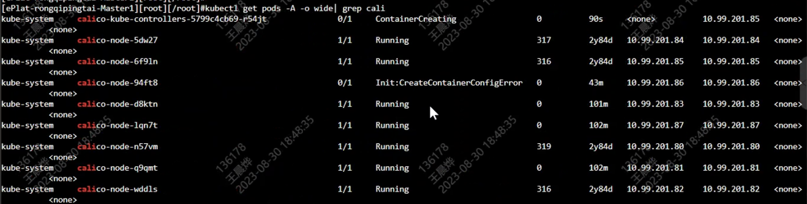

---
kind:
  - Troubleshooting
products:
  - Alauda Container Platform
  - Alauda DevOps
  - Alauda AI
  - Alauda Application Services
  - Alauda Service Mesh
  - Alauda Developer Portal
ProductsVersion:
  - 4.1.0,4.2.x
---
<!-- A type of document that involves encountering a fault, diagnosing it, performing root cause analysis, and providing solutions. -->

# 集群升级时：IPAMBlock.crd.projectcalico.org xxx is invalid: spec.deleted: Required value

calico 升级故障，pod 无法正常创建 IPAMBlock.crd.projectcalico.org xxx is invalid: spec.deleted: Required value 节点上的 calico-node 异常（kubectl 报错 sync configmap cache）

## Cause
- 部分节点上的 calico-node 仍运行老版本
- 故障的 calico-kube-controllers 调度到了未更新的老版本节点

## Resolution
- 手动删除老版本 calico-node 触发更新

## [workaround]

## [Related Information]
**Screenshots**

- IPAMBlock.crd.projectcalico.org
- calico-node
- calico-kube-controllers
- kubectl get ipamblock
- Component: 升级
- Page ID: 161393134
- Original Title: 集群升级时：IPAMBlock.crd.projectcalico.org xxx is invalid: spec.deleted: Required value
