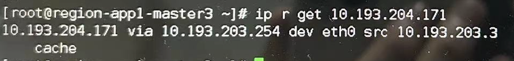
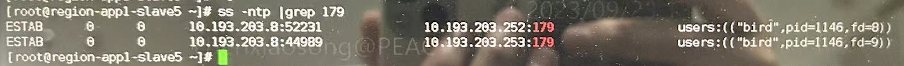
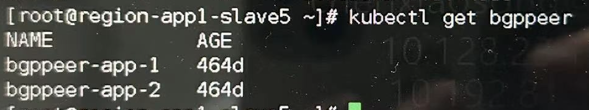
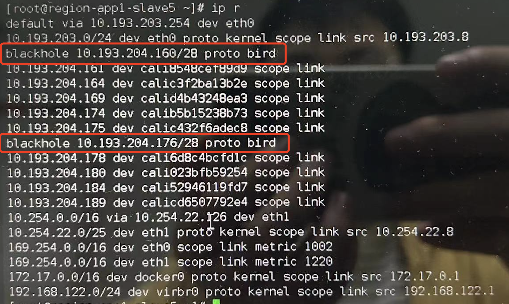
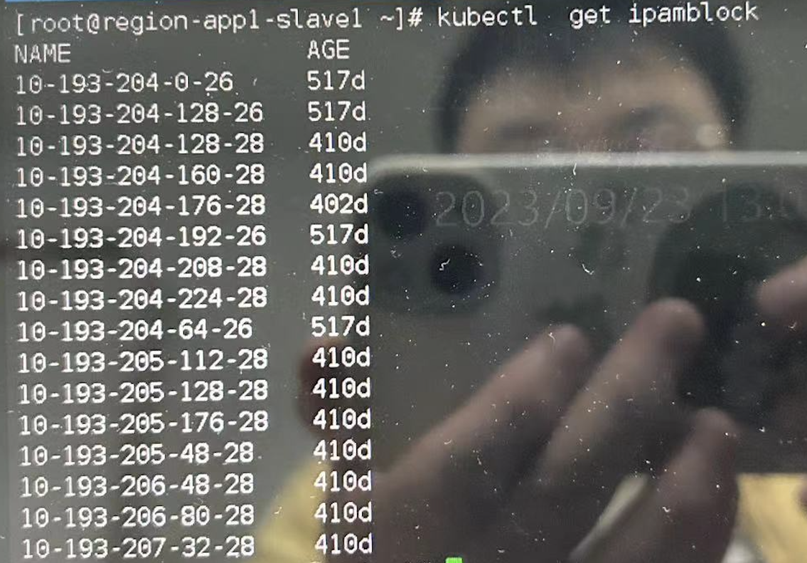
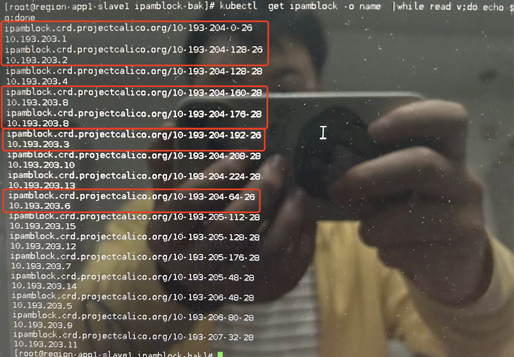

---
kind:
  - Troubleshooting
products:
  - Alauda Container Platform
  - Alauda DevOps
  - Alauda AI
  - Alauda Application Services
  - Alauda Service Mesh
  - Alauda Developer Portal
ProductsVersion:
  - 4.1.0,4.2.x
---
<!-- A type of document that involves encountering a fault, diagnosing it, performing root cause analysis, and providing solutions. -->

# 集群升级后节点无法访问部分其他节点上的 Pod

节点无法被其他节点访问 ip route get <POD_IP>显示下一跳为节点网卡网关地址 抓包显示外部网关未转发流量

## Cause
- 修改子网CIDR时遗漏操作导致IPAMBlock子网掩码不一致

## Resolution

## [workaround]

## [Related Information]
**Screenshots**

- BGP
- BGPPeer
- Route Reflector
- IPAMBlock
- calico
- kubectl get ipamblock
- Component: 升级
- Page ID: 163078351
- Original Title: 集群升级后节点无法访问部分其他节点上的 Pod
