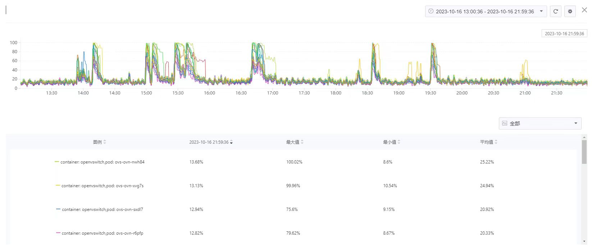
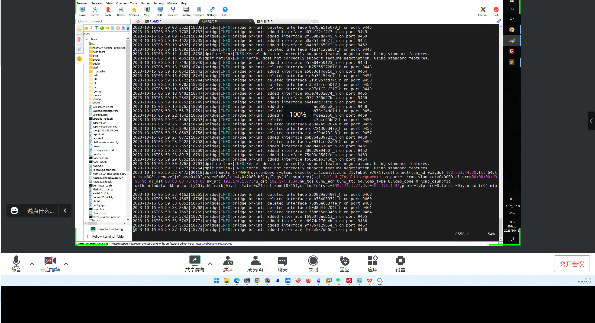
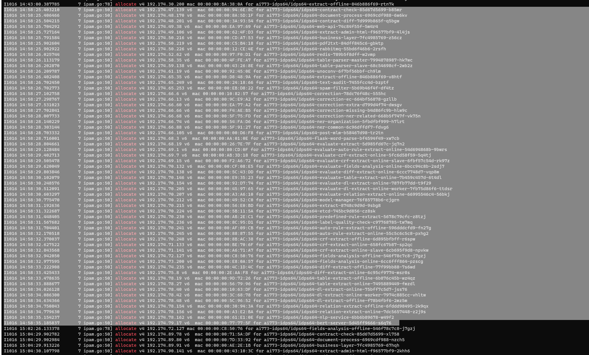

---
kind:
  - Troubleshooting
products:
  - Alauda Container Platform
  - Alauda DevOps
  - Alauda AI
  - Alauda Application Services
  - Alauda Service Mesh
  - Alauda Developer Portal
ProductsVersion:
  - 4.1.0,4.2.x
---
<!-- A type of document that involves encountering a fault, diagnosing it, performing root cause analysis, and providing solutions. -->

# 招商证劵

ovs-ovn周期性的cpu使用率增高 ovs-vswitchd.log中频繁出现ovs interface增删记录（1分钟100+次）

## Cause
- ovs接口频繁增删导致cpu升高
- 异常pod重启引发ovs操作

## Resolution
- 检查并处理异常重启的pod

## [workaround]

## [Related Information]
**Screenshots**

- Environment: ACP3.10.2
- ovs-ovn
- ovs-vswitchd.log
- pod重启
- interface增删
- Component: 升级
- Page ID: 165015050
- Original Title: 招商证劵-升级3.10.2后平台健康状态页面显示异常
