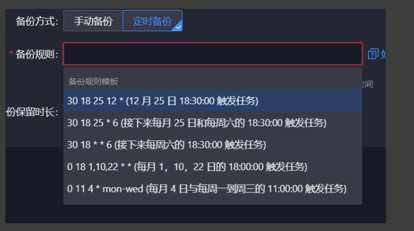
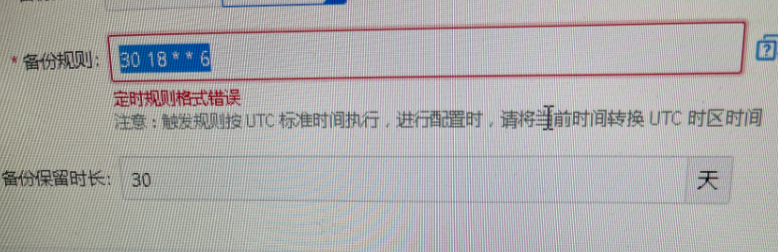
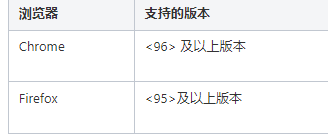

---
kind:
  - Troubleshooting
products:
  - Alauda Container Platform
  - Alauda DevOps
  - Alauda AI
  - Alauda Application Services
  - Alauda Service Mesh
  - Alauda Developer Portal
ProductsVersion:
  - 4.1.0,4.2.x
---
<!-- A type of document that involves encountering a fault, diagnosing it, performing root cause analysis, and providing solutions. -->

# 3.12.2

定时策略选择已有定时模版提示格式错误

## Cause
- 浏览器版本较低

## Resolution
- 升级浏览器版本

## [workaround]

## [Related Information]
**Screenshots**

- Environment: 3.12.X
- Component: 升级
- Page ID: 168321114
- Original Title: 3.12.2-etcd备份功能-定时策略选择已有定时模版提示格式错误-浏览器版本问题
