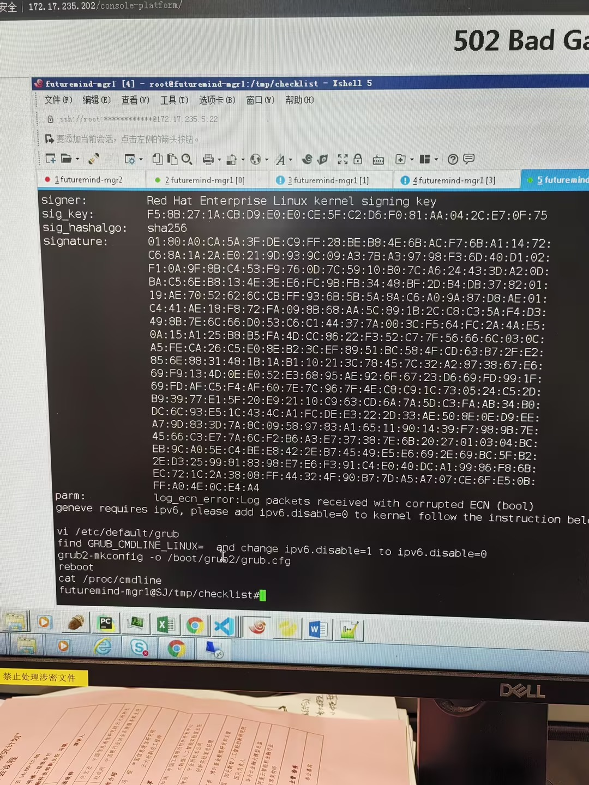
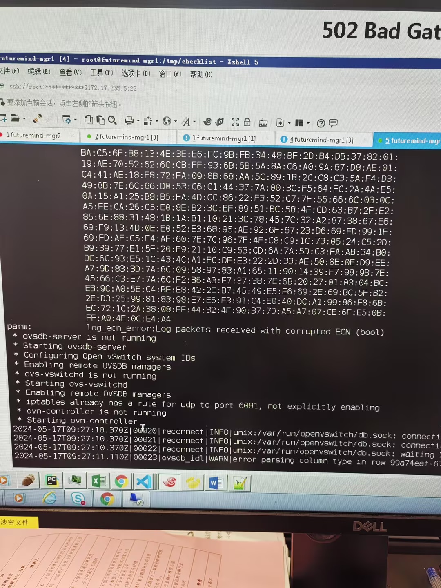
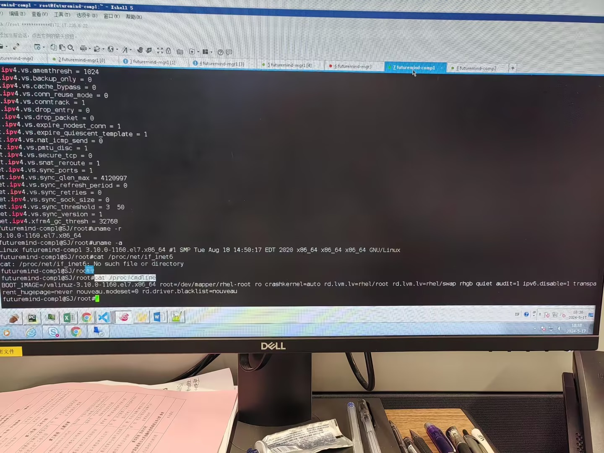

---
kind:
  - Troubleshooting
products:
  - Alauda Container Platform
  - Alauda DevOps
  - Alauda AI
  - Alauda Application Services
  - Alauda Service Mesh
  - Alauda Developer Portal
ProductsVersion:
  - 4.1.0,4.2.x
---
<!-- A type of document that involves encountering a fault, diagnosing it, performing root cause analysis, and providing solutions. -->

# 中金所，TKE 3.0 升级 3.4 环境，ovs

ovs-ovn pod 在四个 worker 节点上 crash pod log 显示节点上 ipv6 未开启

## Cause
- worker 节点 /proc/cmdline 存在 ipv6.disable=1 配置
- ovs-ovn 组件依赖 IPv6 功能（包括 IPv4 单栈环境）

## Resolution
- 修改 grub 配置设置 ipv6.disable=0
- 将 grub 配置文件放置到正确路径
- 重启节点生效配置

## [workaround]

## [Related Information]
**Screenshots**

- Environment: TKE 3.0 升级 3.4 环境，ovs-ovn CNI
- ovs-ovn
- ipv6.disable
- /proc/cmdline
- grub 配置文件路径
- Component: 升级
- Page ID: 210436494
- Original Title: 中金所，TKE 3.0 升级 3.4 环境，ovs-ovn 起不来
