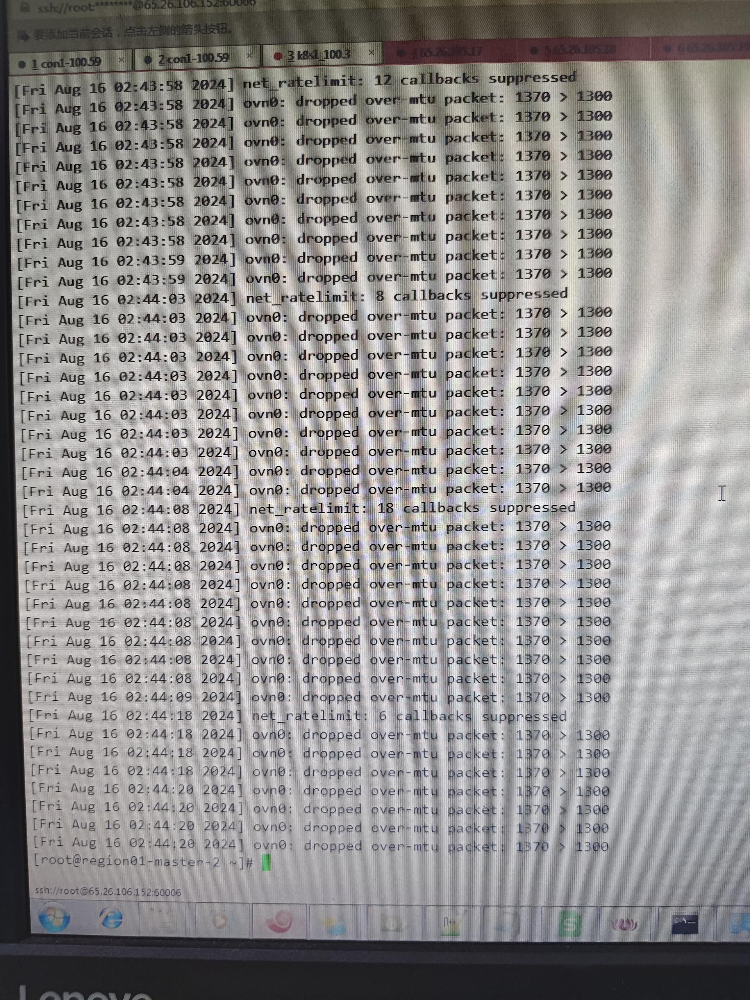

---
kind:
  - Troubleshooting
products:
  - Alauda Container Platform
  - Alauda DevOps
  - Alauda AI
  - Alauda Application Services
  - Alauda Service Mesh
  - Alauda Developer Portal
ProductsVersion:
  - 4.1.0,4.2.x
---
<!-- A type of document that involves encountering a fault, diagnosing it, performing root cause analysis, and providing solutions. -->

# 湖南省公安厅3.10 升级 3.14.1发现api

api-server访问metis域名请求超时 抓包显示报文length=1370 dmesg日志显示MTU问题

## Cause
- master节点网卡MTU=1400，其他节点MTU=1500导致MTU不匹配

## Resolution
- kube-ovn-cni中args添加--mtu=1300并重启pod
- 同步所有非master节点pod的MTU为1300

## [workaround]
- 重启metis pod临时解决

## [Related Information]
**Screenshots**

- kube-ovn-cni
- metis
- api-server
- Service IP
- Component: 升级
- Page ID: 227249874
- Original Title: 湖南省公安厅3.10 升级 3.14.1发现api-server访问metis失败
