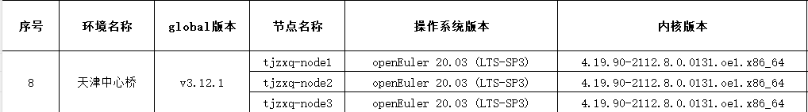
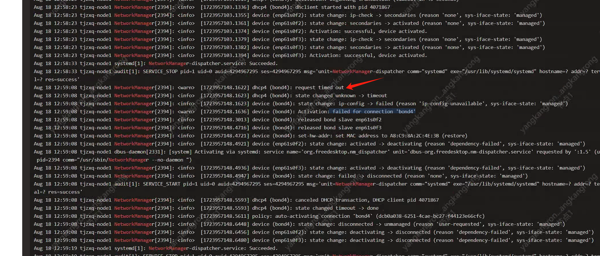

---
kind:
  - Troubleshooting
products:
  - Alauda Container Platform
  - Alauda DevOps
  - Alauda AI
  - Alauda Application Services
  - Alauda Service Mesh
  - Alauda Developer Portal
ProductsVersion:
  - 4.1.0,4.2.x
---
<!-- A type of document that involves encountering a fault, diagnosing it, performing root cause analysis, and providing solutions. -->

# ACP 升级后 bond网卡受networkmanager 影响起不来

bond4 网卡在手动 up 后又被 NetworkManager 关闭

## Cause
- NetworkManager 错误管理 bond4
- 配置网卡后未重新加载
- NetworkManager 潜在 Bug (如 Red Hat Bugzilla 1800523)

## Resolution
- 执行命令 nmcli device set bond4 managed no

## [workaround]

## [Related Information]
**Screenshots**

- bond4
- NetworkManager
- nmcli
- HNSGAT-16
- RHSZYJS-13
- Component: 升级
- Page ID: 228557113
- Original Title: ACP 升级后 bond网卡受networkmanager 影响起不来
