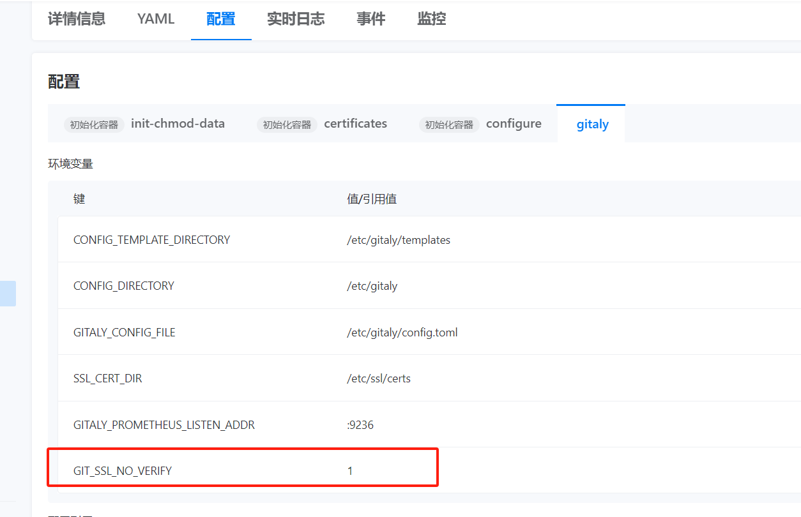

---
kind:
  - Troubleshooting
products:
  - Alauda Container Platform
  - Alauda DevOps
  - Alauda AI
  - Alauda Application Services
  - Alauda Service Mesh
  - Alauda Developer Portal
ProductsVersion:
  - 4.1.0,4.2.x
---
<!-- A type of document that involves encountering a fault, diagnosing it, performing root cause analysis, and providing solutions. -->

# gitlab功能mirror repositories使用https请求，提示ssl证书校验不通过

ssl证书校验不通过

## Cause
- HTTPS请求时SSL证书验证失败

## Resolution
- 修改gitaly的configmap配置：[[git.config]]
key = "http.sslVerify"
value = "false"
- 在configmap的annotation添加：skip-sync: "true"
- 为gitlay容器添加环境变量：GIT_SSL_NO_VERIFY=true

## [workaround]

## [Related Information]
**Screenshots**

- Environment: 3.14.2
- gitaly
- configmap
- http.sslVerify
- GIT_SSL_NO_VERIFY
- Component: 升级
- Page ID: 231114692
- Original Title: Devops-gitlab功能mirror repositories使用https请求，提示ssl证书校验不通过
