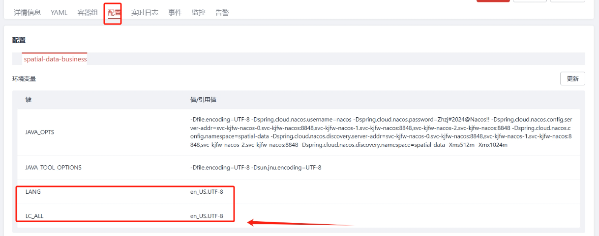

---
kind:
  - Troubleshooting
products:
  - Alauda Container Platform
  - Alauda DevOps
  - Alauda AI
  - Alauda Application Services
  - Alauda Service Mesh
  - Alauda Developer Portal
ProductsVersion:
  - 4.1.0,4.2.x
---
<!-- A type of document that involves encountering a fault, diagnosing it, performing root cause analysis, and providing solutions. -->

# 在业务视图下，exec 进容器中'文件传输' 功能无法使用

在业务视图下exec进入容器时'上传文件'功能无法使用

## Cause
- 平台版本<3.16且容器内tar --help输出为中文导致识别失败

## Resolution
- 设置容器环境变量 LANG=en_US.UTF-8 和 LC_ALL=en_US.UTF-8
- 升级平台至3.16及以上版本

## [workaround]
- 临时设置容器环境变量 LANG=en_US.UTF-8 和 LC_ALL=en_US.UTF-8

## [Related Information]
**Screenshots**

- Environment: 平台版本<3.16
- tar命令
- LANG环境变量
- LC_ALL环境变量
- 平台版本
- Component: 升级
- Page ID: 242091356
- Original Title: 在业务视图下，exec 进容器中'文件传输' 功能无法使用
