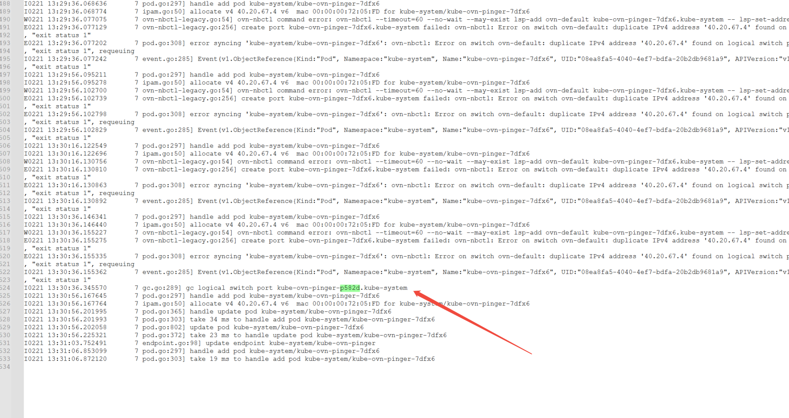
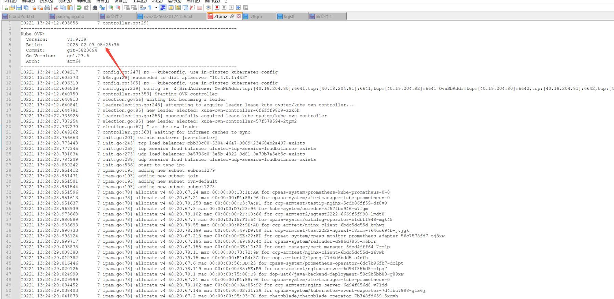

---
kind:
  - Troubleshooting
products:
  - Alauda Container Platform
  - Alauda DevOps
  - Alauda AI
  - Alauda Application Services
  - Alauda Service Mesh
  - Alauda Developer Portal
ProductsVersion:
  - 4.1.0,4.2.x
---
<!-- A type of document that involves encountering a fault, diagnosing it, performing root cause analysis, and providing solutions. -->

# 3.12.4 hotfix 升级 kube

kube-ovn-pinger 处于 ContainerCreating 状态 5 分钟 ovs-ovn 版本未更新到 1.9.39 仍为 1.9.35

## Cause
- kube-ovn-controller 未初始化 40.20.67.4 的 IPAM
- ovs-ovn DaemonSet 使用 onDelete 策略且未主动删除旧 Pod

## Resolution
- 手动删除 ovs-ovn DaemonSet 的旧 Pod 触发更新
- 等待 5 分钟触发 GC 机制自动修复

## [workaround]

## [Related Information]
**Screenshots**

- Environment: ACP v3.12.4
- kube-ovn-controller
- kube-ovn-pinger
- ovs-ovn DaemonSet
- RolloutPolicy=onDelete
- Component: 升级
- Page ID: 266895466
- Original Title: 3.12.4 hotfix 升级 kube-ovn-pinger启动得花5min
