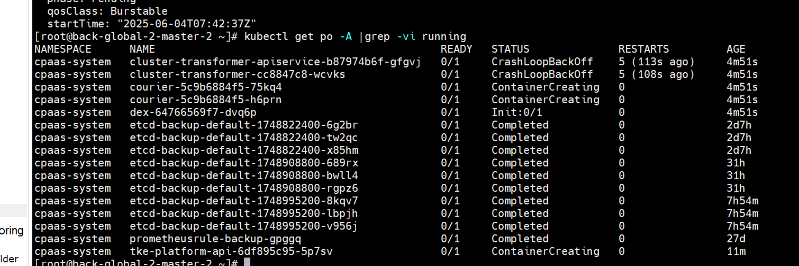
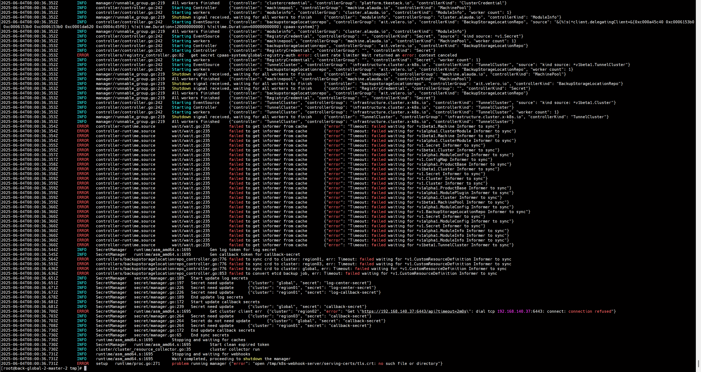
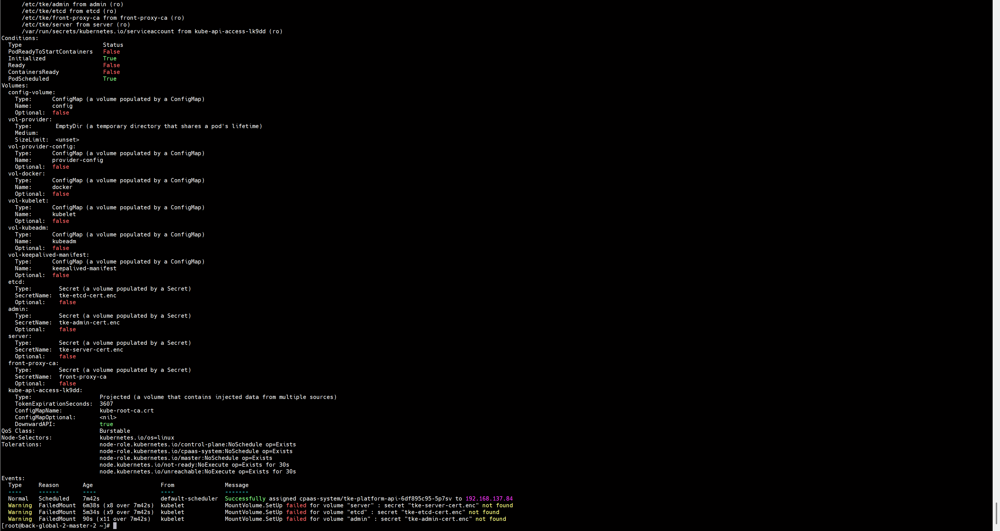
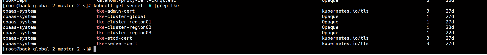
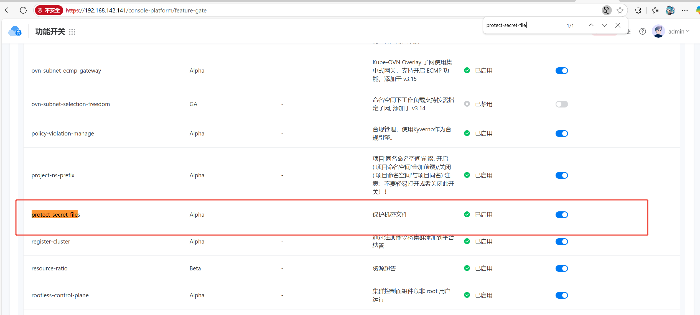

---
kind:
  - Troubleshooting
products:
  - Alauda Container Platform
  - Alauda DevOps
  - Alauda AI
  - Alauda Application Services
  - Alauda Service Mesh
  - Alauda Developer Portal
ProductsVersion:
  - 4.1.0,4.2.x
---
<!-- A type of document that involves encountering a fault, diagnosing it, performing root cause analysis, and providing solutions. -->

# 备GLOBAL集群执行  bash upgrade.sh 失败

执行升级脚本时检查到`productbase`组件未处于运行状态（Running）

## Cause
- `productbase`组件未正常运行导致升级流程依赖检查失败

## Resolution
- 检查组件状态：kubectl get pods -n [namespace] | grep productbase
- 查看组件日志：kubectl logs [productbase-pod-name] -n [namespace]
- 修复组件异常后重新执行：bash upgrade.sh

## [workaround]

## [Related Information]
**Screenshots**

- Environment: v3.18.1
- productbase
- upgrade.sh
- Component: 升级
- Page ID: 308806149
- Original Title: 基础架构-备GLOBAL集群执行  bash upgrade.sh 失败-109867-zh
