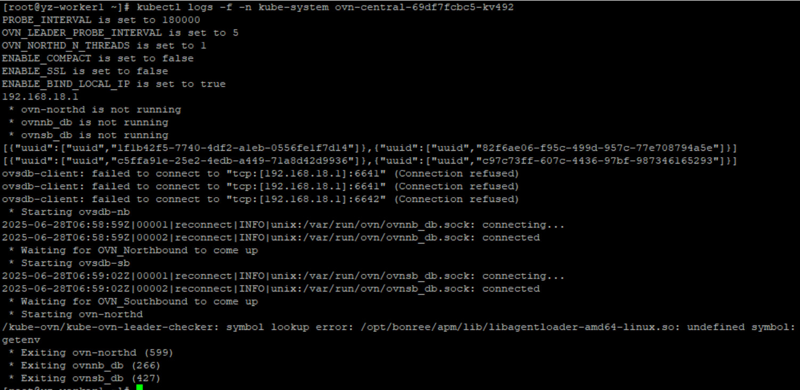
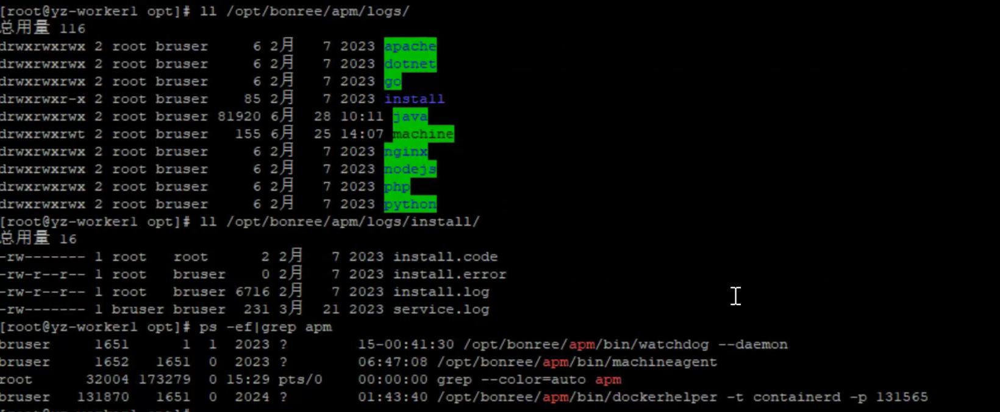

---
kind:
  - Troubleshooting
products:
  - Alauda Container Platform
  - Alauda DevOps
  - Alauda AI
  - Alauda Application Services
  - Alauda Service Mesh
  - Alauda Developer Portal
ProductsVersion:
  - 4.1.0,4.2.x
---
<!-- A type of document that involves encountering a fault, diagnosing it, performing root cause analysis, and providing solutions. -->

# Kube

升级流程卡住，无法继续进行 kube-ovn-controller和kube-ovn-cni的Pod处于CrashLoopBackOff状态 ovn-central日志报错存在程序调用libagentloader.do动态库异常

## Cause
- kube-ovn 3.16.2版本对底层数据库有新的要求，与现有数据库版本不兼容
- 客户侧apm组件路径/opt/bonree/apm/lib/libagentloader-amd64-linux.so与当前版本组件存在冲突

## Resolution
- 转移/opt/bonree/apm/lib/libagentloader-amd64-linux.so文件

## [workaround]

## [Related Information]
**Screenshots**

- Environment: v3.16.2
- kube-ovn-controller
- kube-ovn-cni
- ovn-central
- /opt/bonree/apm/lib/libagentloader-amd64-linux.so
- Component: 升级
- Page ID: 309297674
- Original Title: 容器平台-网络-Kube-OVN-kube-ovn升级卡住-111787-zh
