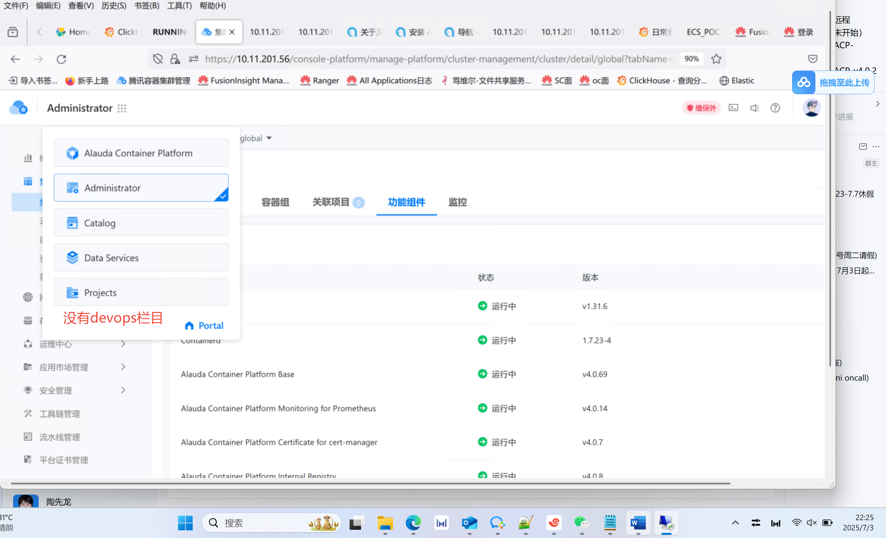
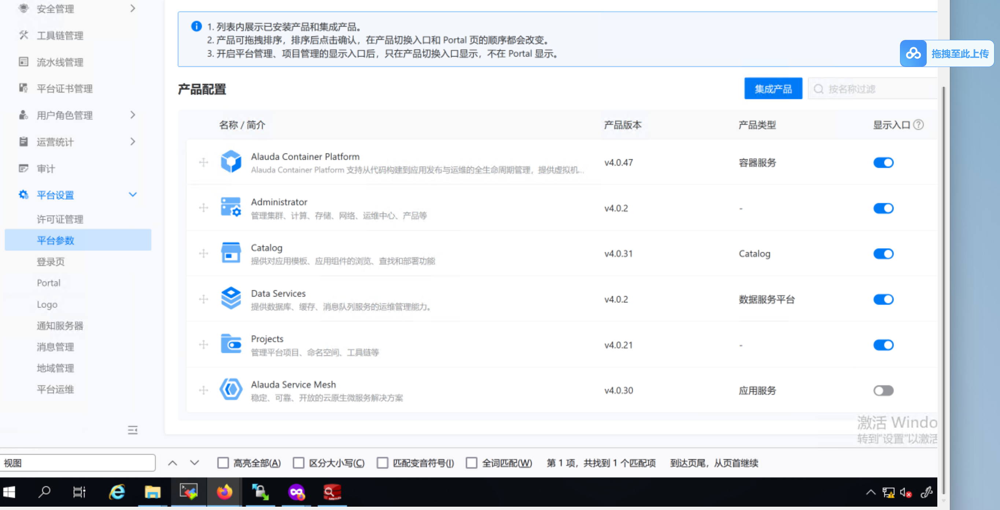
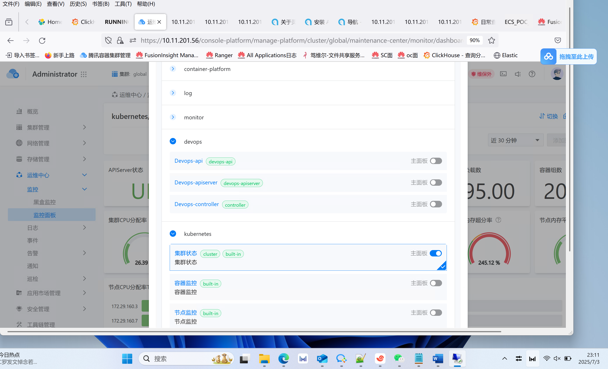

---
kind:
  - Troubleshooting
products:
  - Alauda Container Platform
  - Alauda DevOps
  - Alauda AI
  - Alauda Application Services
  - Alauda Service Mesh
  - Alauda Developer Portal
ProductsVersion:
  - 4.1.0,4.2.x
---
<!-- A type of document that involves encountering a fault, diagnosing it, performing root cause analysis, and providing solutions. -->

# 升级到4.0.2后点击工具链管理，跳转到空白页

升级到4.0.2后点击工具链管理跳转到空白页 devops模块消失

## Cause
- devops相关monitordashboard旧版本未被删除导致更新卡住

## Resolution
- 手动在监控面板处删除devops相关面板

## [workaround]

## [Related Information]
**Screenshots**

- Environment: 4.0.2
- monitordashboard
- devops
- Component: 升级
- Page ID: 321043641
- Original Title: 基础架构-产品生命周期管理-升级-升级到4.0.2后点击工具链管理，跳转到空白页-112270
