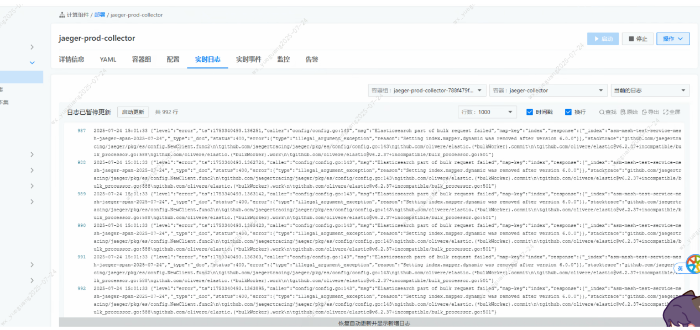
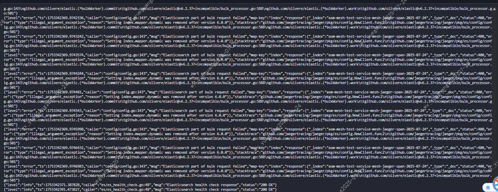
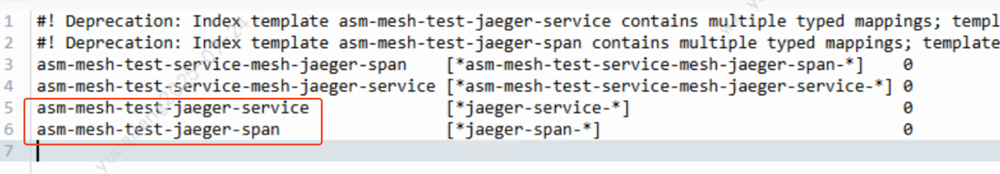

---
kind:
  - Troubleshooting
products:
  - Alauda Container Platform
  - Alauda DevOps
  - Alauda AI
  - Alauda Application Services
  - Alauda Service Mesh
  - Alauda Developer Portal
ProductsVersion:
  - 4.1.0,4.2.x
---
<!-- A type of document that involves encountering a fault, diagnosing it, performing root cause analysis, and providing solutions. -->

# 3.14升级到3.18后，service mesh调用链没数据

service mesh调用链没数据 es里面没有索引数据 jaeger-prod-collector日志显示模版格式问题

## Cause
- Elasticsearch中存在有问题的索引模版

## Resolution
- 删除ES中与asm相关的有问题的索引模版
- 重启jaeger组件

## [workaround]

## [Related Information]
**Screenshots**

- Environment: 3.18.1
- jaeger-prod-collector
- Elasticsearch
- 索引模版
- Component: 升级
- Page ID: 324174106
- Original Title: 微服务-云原生应用-Istio相关-3.14升级到3.18后，service mesh调用链没数据-113614
