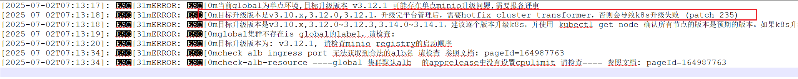

---
kind:
  - Troubleshooting
products:
  - Alauda Container Platform
  - Alauda DevOps
  - Alauda AI
  - Alauda Application Services
  - Alauda Service Mesh
  - Alauda Developer Portal
ProductsVersion:
  - 4.1.0,4.2.x
---
<!-- A type of document that involves encountering a fault, diagnosing it, performing root cause analysis, and providing solutions. -->

# checklist检查告警 hotfix cluster

JIRA Jira：

## Cause

## Resolution
- 替换cluster-transformer镜像后执行集群管理升级
- 修改BroadcastJob配置：kubectl edit cm -n cpaas-system cluster-upgrade-templates
- 将ttlSecondsAfterFinished: 300改为ttlSecondsAfterFinished: 30
- 将type: FailFast改为type: Continue

## [workaround]

## [Related Information]
**Screenshots**

- Environment: 3.12
- cluster-upgrade-templates
- BroadcastJob
- ttlSecondsAfterFinished
- type
- Component: 升级
- Page ID: 330465914
- Original Title: 基础架构-checklist检查告警 hotfix cluster-transformer 版本v3.12.0-112174
