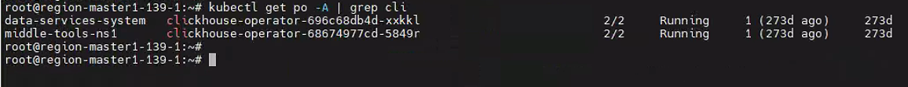
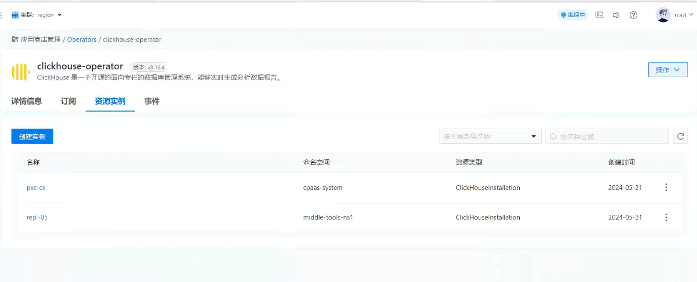
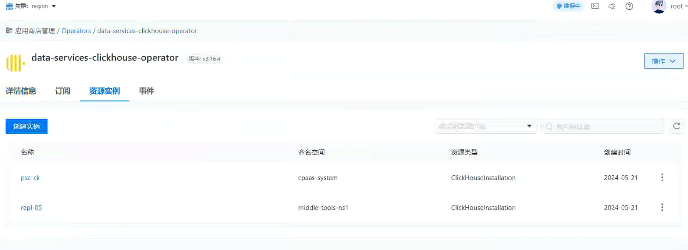

---
kind:
  - Troubleshooting
products:
  - Alauda Container Platform
  - Alauda DevOps
  - Alauda AI
  - Alauda Application Services
  - Alauda Service Mesh
  - Alauda Developer Portal
ProductsVersion:
  - 4.1.0,4.2.x
---
<!-- A type of document that involves encountering a fault, diagnosing it, performing root cause analysis, and providing solutions. -->

# 平台升级，S2方案：clickhouse

JIRA Jira：

## Cause
- 中间件的operator以命名空间方式部署

## Resolution
- 将中间件的operator部署模式从命名空间方式改为集群模式

## [workaround]

## [Related Information]
**Screenshots**

- Environment: 3.16.1升级到4.0.3
- operator
- 命名空间
- 集群模式
- Component: 升级
- Page ID: 330466132
- Original Title: 基础架构-产品生命周期管理-升级-平台升级，S2方案：clickhouse-114730
