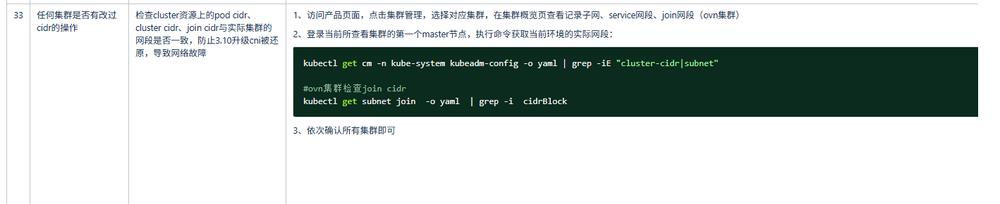
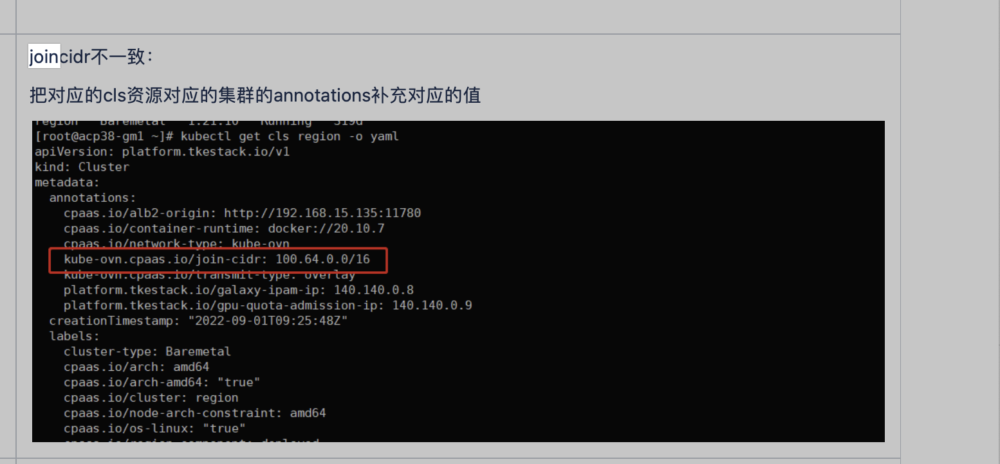

---
kind:
  - Troubleshooting
products:
  - Alauda Container Platform
  - Alauda DevOps
  - Alauda AI
  - Alauda Application Services
  - Alauda Service Mesh
  - Alauda Developer Portal
ProductsVersion:
  - 4.1.0,4.2.x
---
<!-- A type of document that involves encountering a fault, diagnosing it, performing root cause analysis, and providing solutions. -->

# 升级checklist检查，join网段不一致

升级checklist检查提示join网段不一致

## Cause
- join配置网段与集群子网(subnet)不一致

## Resolution
- 修改join配置网段使其与集群子网保持一致

## [workaround]

## [Related Information]
**Screenshots**

- Environment: 3.16.2
- cluster-cidr
- join配置
- subnet配置
- Component: 升级
- Page ID: 330466186
- Original Title: 基础架构-产品生命周期管理-升级-升级checklist检查，join网段不一致-115000
