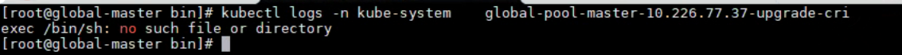
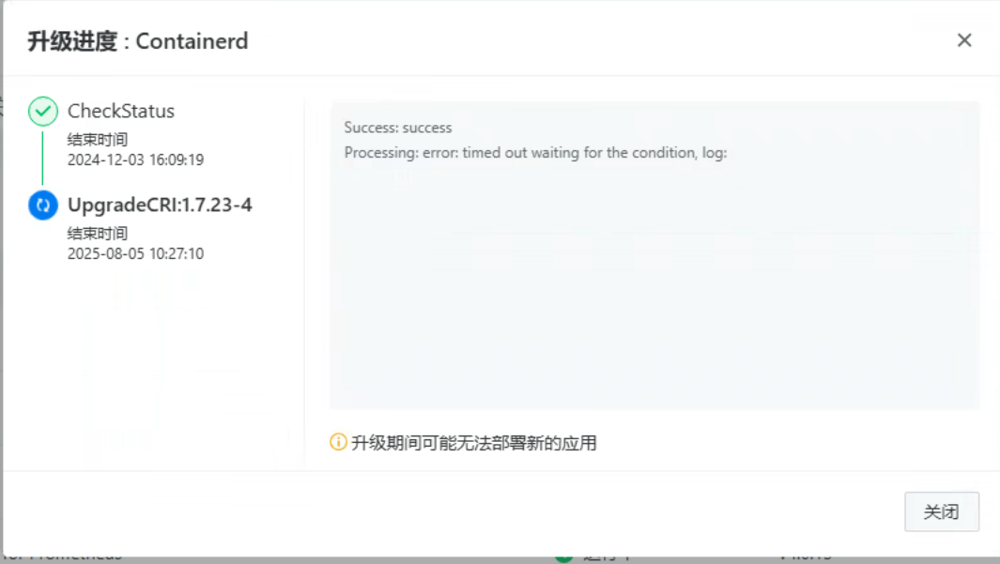

---
kind:
  - Troubleshooting
products:
  - Alauda Container Platform
  - Alauda DevOps
  - Alauda AI
  - Alauda Application Services
  - Alauda Service Mesh
  - Alauda Developer Portal
ProductsVersion:
  - 4.1.0,4.2.x
---
<!-- A type of document that involves encountering a fault, diagnosing it, performing root cause analysis, and providing solutions. -->

# 平台升级cri 失败

平台升级containerd cri 失败。报错信息如图 原因是由于 /usr 挂载到了主机中，大多数os上有 /usr/bin/sh，sh 真正将使用 /usr/bin/sh，不会有问题。但Astra OS 的/usr/bin/sh 指向了 /bin/bash，而在容器中不存在 /bin/bash，报错。

## Cause

## Resolution
- ## 解决方案

## [workaround]

## [Related Information]
**Screenshots**

- /usr/bin/sh
- /bin/bash
- 16
- /ji-chu-jia-gou-chan-pin-sheng-ming-zhou-qi-guan-li-sheng-ji-ping-tai-sheng-ji-cr/1754362978_99781_c4449e_1111111.png
- /ji-chu-jia-gou-chan-pin-sheng-ming-zhou-qi-guan-li-sheng-ji-ping-tai-sheng-ji-cr/1754362978_99781_21dec2_2222222222.png
- /lib/ld-musl-x86
- /lib
- /usr
- Component: 升级
- Page ID: 330466274
- Original Title: 基础架构-产品生命周期管理-升级-平台升级cri 失败-114421
