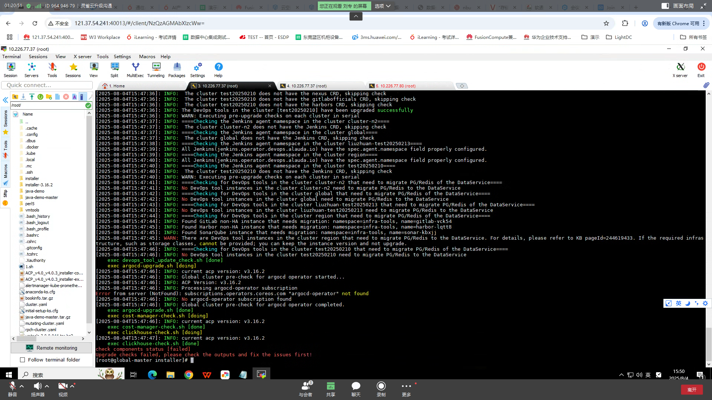

---
kind:
  - Troubleshooting
products:
  - Alauda Container Platform
  - Alauda DevOps
  - Alauda AI
  - Alauda Application Services
  - Alauda Service Mesh
  - Alauda Developer Portal
ProductsVersion:
  - 4.1.0,4.2.x
---
<!-- A type of document that involves encountering a fault, diagnosing it, performing root cause analysis, and providing solutions. -->

# 平台3.16.2 升级到 4.0.3 报错

JIRA Jira：

## Cause
- 存在未处理的etcd备份策略

## Resolution
- 清理或更新etcd备份策略

## [workaround]

## [Related Information]
**Screenshots**

- Environment: 3.16.2升级到4.0.3
- etcd
- Component: 升级
- Page ID: 330466278
- Original Title: 基础架构-产品生命周期管理-升级-平台3.16.2 升级到 4.0.3 报错-114340
