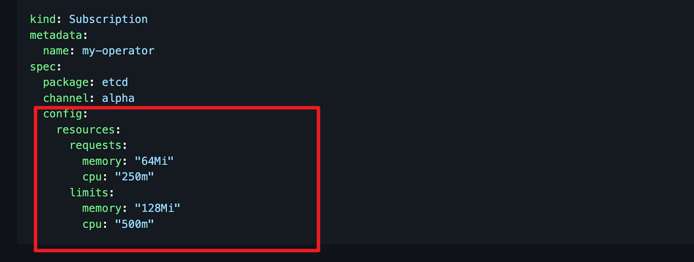

---
kind:
  - Troubleshooting
products:
  - Alauda Container Platform
  - Alauda DevOps
  - Alauda AI
  - Alauda Application Services
  - Alauda Service Mesh
  - Alauda Developer Portal
ProductsVersion:
  - 4.1.0,4.2.x
---
<!-- A type of document that involves encountering a fault, diagnosing it, performing root cause analysis, and providing solutions. -->

# operators名称空间2个应用运行状态不正常是否会影响集群升级

rds-operator-controller-manager容器OOMKilled inspection-operator容器OOMKilled STATUS显示OOMKilled/RESTARTS频繁重启

## Cause
- 容器内存资源限制(limits.memory)不足导致OOM

## Resolution
- 修改rds-operator的Subscription资源配置: kubectl edit subs -n operators rds-operator
- 修改RdsInstaller CRD资源配置: kubectl edit rdsinstaller rds
- 调整spec.config.resources.limit.memory参数值(如2Gi)

## [workaround]

## [Related Information]
**Screenshots**

- Environment: 3.14.2
- operators/rds-operator-controller-manager
- operators/inspection-operator
- Subscription/rds-operator
- RdsInstaller/rds
- spec.config.resources.limits.memory
- Component: 升级
- Page ID: 333316242
- Original Title: 数据服务-数据服务-operators名称空间2个应用运行状态不正常是否会影响集群升级-114853
