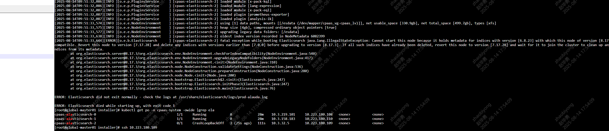

---
kind:
  - Troubleshooting
products:
  - Alauda Container Platform
  - Alauda DevOps
  - Alauda AI
  - Alauda Application Services
  - Alauda Service Mesh
  - Alauda Developer Portal
ProductsVersion:
  - 4.1.0,4.2.x
---
<!-- A type of document that involves encountering a fault, diagnosing it, performing root cause analysis, and providing solutions. -->

# es升级失败

es副本中有一个pod启动失败，镜像版本为8，正常pod为7 异常pod日志报错索引版本不兼容

## Cause
- 4.0版本升级到es8导致索引版本不兼容

## Resolution
- 修改minfo配置临时维持es7运行状态
- kubectl edit minfo <global-e671599464a5b1717732c5ba36079795>
- 在spec.valuesOverride.ait/chart-alauda-log-center.elasticsearch下添加v8Enabled: false和v8Ready: false
- 触发ars更新

## [workaround]

## [Related Information]
**Screenshots**

- Environment: 3.16.2升级4.0.x
- minfo
- ait/chart-alauda-log-center
- elasticsearch.v8Enabled
- elasticsearch.v8Ready
- Component: 升级
- Page ID: 333316446
- Original Title: 基础架构-产品生命周期管理-升级-es升级失败-115237
