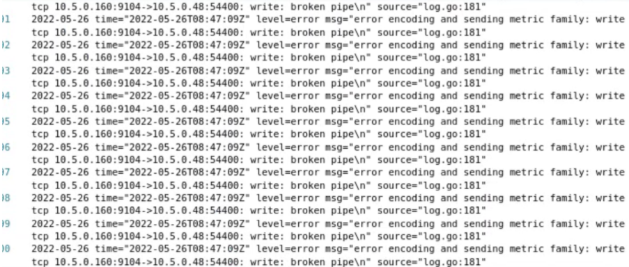
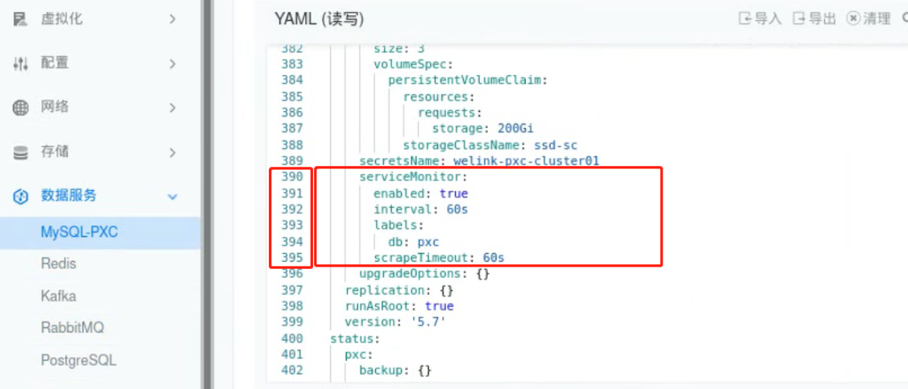

---
kind:
  - Troubleshooting
products:
  - Alauda Container Platform
  - Alauda DevOps
  - Alauda AI
  - Alauda Application Services
  - Alauda Service Mesh
  - Alauda Developer Portal
ProductsVersion:
  - 4.1.0,4.2.x
---
<!-- A type of document that involves encountering a fault, diagnosing it, performing root cause analysis, and providing solutions. -->

# PXC

PXC-exporter容器频繁重启 检查日志报错涉及超时

## Cause
- 超时参数设置不当导致监控抓取超时

## Resolution
- 通过更改pxc实例内容，增加调整配置如下（增加export相关超时时间），增加后手动重启此pxc实例

    serviceMonitor:
      labels:
        db: 'pxc'
      enabled: true
      interval: 60s
      scrapeTimeout: 60s

## [workaround]

## [Related Information]
**Screenshots**

- Environment: 3.6.*
- serviceMonitor
- interval
- scrapeTimeout
- PXC实例
- Component: MySQL/PXC
- Page ID: 115525353
- Original Title: PXC-exporter容器频繁重启
