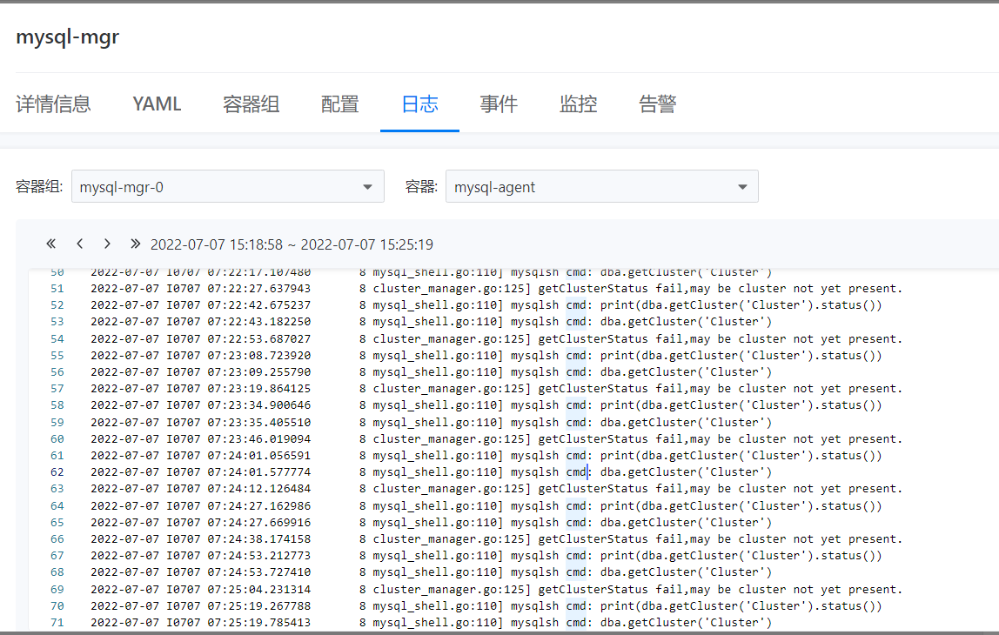
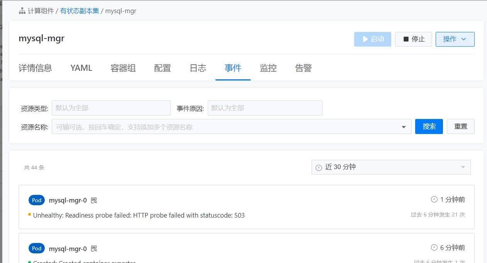
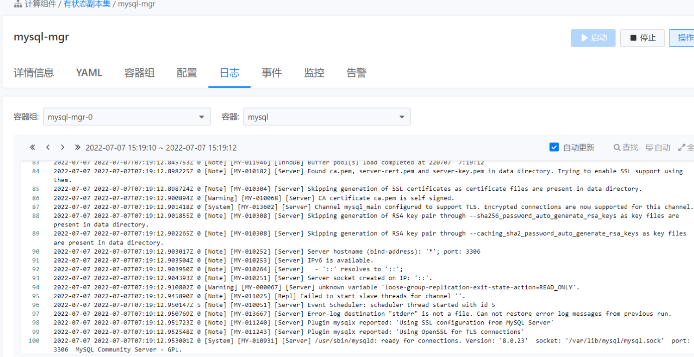
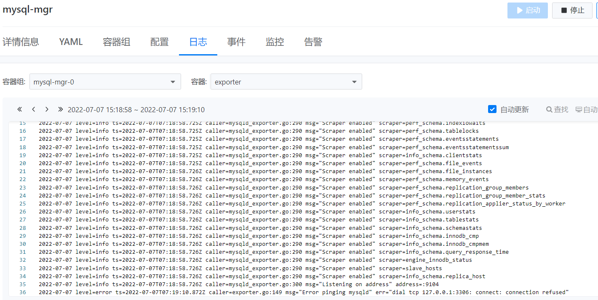
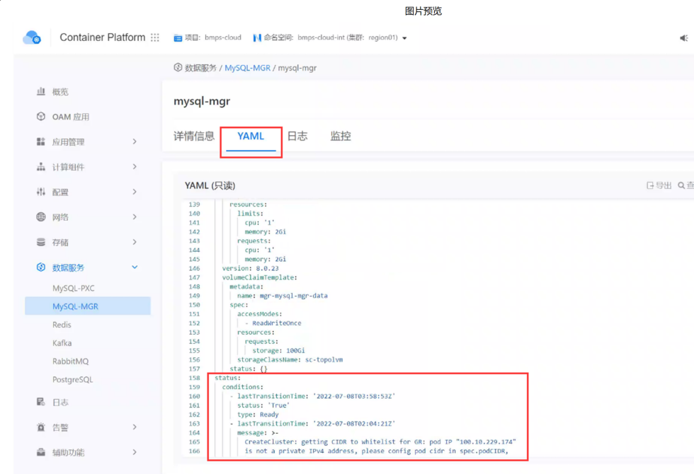
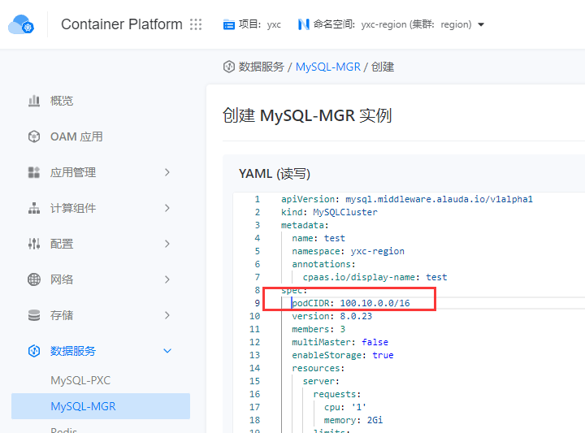

---
kind:
  - Troubleshooting
products:
  - Alauda Container Platform
  - Alauda DevOps
  - Alauda AI
  - Alauda Application Services
  - Alauda Service Mesh
  - Alauda Developer Portal
ProductsVersion:
  - 4.1.0,4.2.x
---
<!-- A type of document that involves encountering a fault, diagnosing it, performing root cause analysis, and providing solutions. -->

# TKE3.8.1

Failed to start slave threads for channel ' '

## Cause
- 使用的CIDR未正确添加到MGR白名单

## Resolution
- 修改mysql-mgr实例yaml文件，添加集群默认cidr子网段到白名单配置

## [workaround]

## [Related Information]
**Screenshots**

- Environment: TKE3.8.1
- mysql-mgr实例yaml
- group_replication_ip_whitelist
- cidr配置
- Component: MySQL/PXC
- Page ID: 120098391
- Original Title: TKE3.8.1-数据服务-部署MYSQL-MGR失败-白名单
